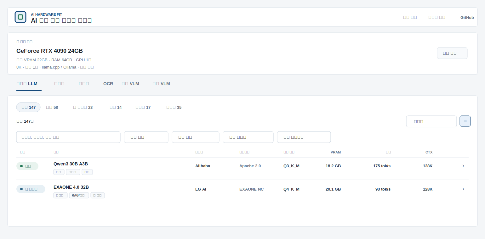

# AI Hardware Fit

  

  <strong>Compare the LLM, embedding, reranker, OCR, and VLM workloads your GPU can run by VRAM, throughput, quality references, and licensing.</strong>

  <a href="https://jaeseok614.github.io/llm-gpu-checker-ko/"><strong>Open the web app</strong></a>
  · <a href="./docs/methodology.md">Methodology</a>
  · <a href="./README.md">한국어</a>
  · <a href="https://github.com/jaeseok614/llm-gpu-checker-ko/issues/new?template=benchmark-report.yml">Report a benchmark</a>

## Why this project?

- Parameter count alone does not tell you whether a model will run well.
- Context length, quantization, concurrency, runtime, and VRAM headroom all matter.
- LLM, RAG, and document-AI components belong in one planning view.

## Highlights

- 90 GPU presets and 286 AI models
- Six workloads: generative LLM, embedding, reranker, OCR, document VLM, and general VLM
- Side-by-side comparison for two or three models, plus heterogeneous and multi-GPU placement
- Source-linked representative public evaluations and plain-language license guidance
- Direct calculation for public Hugging Face models and a local benchmark CLI

## 30-second guide

1. Select your GPU.
2. Select a workload.
3. Review the models and recommended settings that fit.
4. Open a model to inspect the VRAM and throughput basis and its license.

## Typical questions

| Question | What to do |
| --- | --- |
| Which LLMs run on an RTX 3060? | Select the RTX 3060 and open the generative LLM list |
| Can an RTX 4090 host an LLM, embedding model, and reranker together? | Select all three in multi-model GPU placement |
| How should I serve on several A100 GPUs? | Select the A100 and GPU count, then inspect concurrency capacity |
| How do document VLMs compare on VRAM and throughput? | Compare two or three models in the document VLM tab |

## About the numbers

VRAM and throughput are calculated estimates and can differ from a real deployment. The project keeps values with different evidence levels separate:

- **Calculated estimate:** VRAM, speed, and throughput produced by this project's formulas
- **External public reference:** Quality evaluations and reference figures from model cards, papers, or official posts
- **User measurement:** A user-submitted result with reproducible conditions and a source
- **Project measurement:** A result measured directly by this project under controlled conditions

External web figures are never labeled as user or project measurements. Speed calibration requires a matching GPU, model, quantization, runtime, and input/output length.

## Documentation

- [Calculation methodology](./docs/methodology.md)
- [Accuracy and limitations](./docs/accuracy-and-limits.md)
- [Data sources](./docs/data-sources.md)
- [Contributing](./CONTRIBUTING.md)
- [Changelog](./CHANGELOG.md)

Run `npm install` and `npm run check` for local validation. Repository code is distributed under the [MIT License](./LICENSE); every listed AI model retains its own license.
