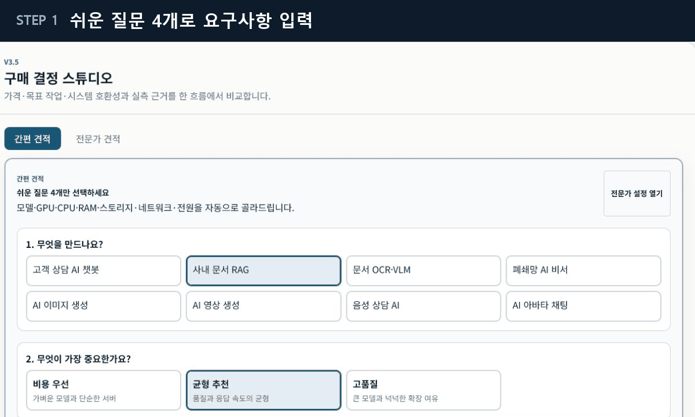

# AI Hardware Fit

<p align="center">
  
</p>

<p align="center">
  <strong>Turn model, traffic, and latency goals into comparable GPU, CPU, RAM, storage, and network plans.<br />An open-source AI infrastructure pre-sales sizing assistant.</strong>
</p>

<p align="center">
  <a href="https://github.com/jaeseok614/llm-gpu-checker-ko/actions/workflows/ci.yml"></a>
  <a href="./LICENSE"></a>
</p>

<p align="center">
  <a href="https://jaeseok614.github.io/llm-gpu-checker-ko/?lang=en"><strong>Open the app</strong></a>
  · <a href="https://jaeseok614.github.io/llm-gpu-checker-ko/?mode=infra&amp;lang=en&amp;studio=consulting"><strong>AI infrastructure sizing</strong></a>
  · <a href="https://jaeseok614.github.io/llm-gpu-checker-ko/?mode=placement&amp;lang=en">AI Stack Placement</a>
  · <a href="./README.md">한국어</a>
  · <a href="https://github.com/jaeseok614/llm-gpu-checker-ko/issues/new?template=gpu-request.yml">Request a GPU</a>
</p>


### v4.8 Preview



## Open a sample scenario

| Scenario | Start |
| --- | --- |
| Internal document RAG · 30 users | [Open quick sizing](https://jaeseok614.github.io/llm-gpu-checker-ko/?mode=infra&lang=en&studio=consulting&scenario=internal-rag&users=30) |
| Customer support chatbot · 100 users | [Open quick sizing](https://jaeseok614.github.io/llm-gpu-checker-ko/?mode=infra&lang=en&studio=consulting&scenario=ai-chatbot&users=100) |
| Real-time AI avatar chat · 50 users | [Open quick sizing](https://jaeseok614.github.io/llm-gpu-checker-ko/?mode=infra&lang=en&studio=consulting&scenario=avatar-chat&users=50) |

## In 10 seconds

- **Developers and individuals** can find LLM, VLM, image, and video models that fit their GPU.
- **Infrastructure teams, MSPs, and server vendors** can turn model, QPS, concurrency, p95, and availability requirements into economy, recommended, and scalable plans.
- **Outputs** include per-server GPU, CPU, RAM, NVMe, NIC, power, TCO, placement, confidence, PoC checks, Excel/PDF, and a deployment draft.

> This tool supports preliminary sizing, comparison, and pre-PoC hypotheses. It does not guarantee performance or produce a final vendor-approved bill of materials.

⭐ If it helps your work, star the repository and share missing real-world pre-sales conditions through an Issue.

## One-line version history

> Add each new release to the top as a single line. See the [CHANGELOG](./CHANGELOG.md) for complete details.

- **v4.8.1** — Simplifies the landing page to three guided paths and samples, then adds a three-step infrastructure wizard, decision-first plans, evidence/price states, and mobile QA.
- **v4.8** — Compares economy, recommended, and scalable options by proposal price, SLA, hardware, rack/power/cooling, failover capacity, and evidence confidence.
- **v4.7** — Adds draft, review, approval, and revision states with owners, reviewers, approvers, timestamps, and saved estimate versions.
- **v4.6** — Sizes rack units, switches, NIC links, optics, cables, redundant PDU circuits, and cooling demand.
- **v4.5** — Adds supplier quote metadata, price dates, validity, discounts, margins, VAT, and final proposal pricing.
- **v4.4** — Validates CPU/socket fit, CPU/RAM/storage capacity, NICs, PSU/UPS headroom, and GPU server fit.
- **v4.3** — Improves easy and expert infrastructure sizing with an editable CPU, RAM, storage, NIC, PSU, UPS, and chassis BOM, live cost totals, and Excel export.
- **v4.2** — Compares 1/3/5-year TCO and utilization-based break-even for on-premises, cloud, and hybrid options.
- **v4.1** — Adds vLLM, llama.cpp, Ollama, and NIM benchmark commands, result JSON import, calibration factors, and PoC verdicts.
- **v4.0** — Adds customer and technical proposal modes, generated architecture and placement diagrams, editable Excel, and print-ready PDF outputs.
- **v3.9** — Adds customer/project estimate versions, change comparison, local save/clone, and JSON export/import.
- **v3.8** — Adds real-time SLA sizing for RPS, concurrency, TTFT, ITL, queueing, batching, replicas, and the STT→LLM→TTS→lip-sync pipeline.
- **v3.7** — Added MuseTalk, LivePortrait, SadTalker, and Wav2Lip as a dedicated avatar/lip-sync catalog connected to model search, GPU Advisor, and AI stack placement.
- **v3.6** — Added STT/TTS to AI stack placement and an avatar-chat preset spanning speech input, LLM response, speech synthesis, and avatar video.
- **v3.5** — Completed detailed SLA inputs, per-server placement and failover capacity, PCIe/NIC/UPS/cooling BOM, TCO outputs, and measured PoC validation.
- **v3.4** — Added an editable Excel estimate, purchase/energy/three-year TCO, PDF proposal summary, and Docker Compose draft.
- **v3.3** — Added PCIe, NVLink/NVSwitch review, NIC, storage, UPS, cooling, backup, and monitoring BOM items.
- **v3.2** — Added per-server GPU configuration, model placement, and remaining capacity after failure for three plans.
- **v3.1.1** — Added industry, owner, data-egress policy, QPS, maximum tokens, TTFT/p95, and operating-hours inputs.
- **v3.1** — Added SI pre-sales sizing with economy, recommended, and scalable infrastructure plans plus CPU, RAM, NVMe, network, power, Excel, and PoC outputs.
- **v3.0** — Unified Korean pricing, guided recommendations, custom models, parts fit, runtime guidance, and measurement contributions into lowest-cost, balanced, and fastest purchase decisions.
- **v2.8** — Added browser-based measurement drafts with contributor/environment records and outlier checks.
- **v2.7** — Added OS-specific runtime difficulty and launch guidance for NVIDIA, AMD, Intel, and Apple.
- **v2.6** — Added CPU, motherboard, PSU, and case products with socket, length, slot, connector, and power compatibility.
- **v2.5** — Added a custom-model calculator for Hugging Face URLs, parameters, layers, precision, context, and vision modules.
- **v2.4** — Added guided GPU recommendations based on workload, speed, budget, condition, form factor, power, and noise.
- **v2.3** — Added source-linked Korean GPU price snapshots and performance/price and VRAM/price rankings.
- **v2.2** — Added a user build calculator for model fit, recommended PSU, total system price, and upgrade order across CPU, RAM, PSU, case, and GPU.
- **v2.0** — Added measurement confidence intervals, Benchmark 2.0, GPU/model deep links, purchase TCO, and Ollama/llama.cpp/vLLM/Docker launch recipes.
- **v1.5** — Expanded to 115 GPUs and added 10 STT/TTS models, a model-first entry screen, model-request auto PRs, and benchmark coverage.
- **v1.4** — Added the model-and-budget-first GPU Advisor, price and energy inputs, current-GPU comparisons, and image/video optimizations.
- **v1.3** — Introduced normalized GPU schemas, laptop TGP scaling, measurement calibration, a dedicated media engine, and GPU detail comparison.
- **v1.2** — Added AI Stack Placement for assigning multiple models across multiple GPUs with shareable constraints and plan comparison.
- **v1.1** — Expanded the catalog with embedding, reranker, OCR/VLM workloads plus benchmark and license information.
- **v1.0** — First public release for checking local LLM compatibility, recommended quantization, and estimated speed from GPU VRAM and runtime settings.

## Highlights

- **AI infrastructure sizing** turns customer traffic, availability, and growth assumptions into three infrastructure plans with shareable links, Excel/PDF outputs, and a PoC checklist.
- **v2.0 Decision Hub** combines measurement confidence, Benchmark 2.0, GPU/model deep links, purchase TCO, and launch recipes.
- Measurement groups expose sample count, median, range, 95% confidence interval, and estimator error.
- Purchase Advisor supports new/used prices, KRW conversion, current-GPU resale value, electricity, and ownership period.
- Launch Assistant generates Ollama, llama.cpp, vLLM, and Docker Compose configurations for the selected model and GPU.
- GPU and model comparison now supports up to four items, with dedicated mobile cards.
- 116 desktop, data-center, Apple Silicon, and laptop GPU presets
- Generative LLM, embedding, reranker, OCR, document/general VLM, image/video generation, avatar/lip-sync, STT, and TTS workloads
- Separate GPU-first and model/budget-first starting paths
- GPU details and three-way comparison across VRAM, bandwidth, runnable models, and estimated speed
- A model-first GPU Advisor ranked by budget, vendor, form factor, value, and monthly energy cost
- Laptop GPU TGP input with power-limit performance scaling
- A dedicated image/video engine that accounts for resolution, steps, frames, FPS, LoRA, offloading, Sage/Flash Attention, and TeaCache
- Measured-data speed calibration and confidence levels for matching GPU/model conditions
- Data-quality labels for official/estimated specifications, verification date, and measurement count
- A benchmark coverage dashboard for measured rows, GPUs, models, estimate error, and priority targets
- AI Stack Placement for assigning several models across several GPUs
- Korean and English interfaces, responsive mobile layouts, keyboard focus, and reduced-motion support
- [Pre-launch UI regression checklist](./docs/ui-regression-checklist.md) for six fixed viewport sizes and eight smoke-tested user flows

## Automated contribution pipelines

GPU and benchmark submissions start from GitHub Issues.

- [Request a GPU](https://github.com/jaeseok614/llm-gpu-checker-ko/issues/new?template=gpu-request.yml): validates official manufacturer sources, schema, duplicates, and laptop TGP, then shows a change preview and creates a data PR after approval.
- [Report a benchmark](https://github.com/jaeseok614/llm-gpu-checker-ko/issues/new?template=benchmark-report.yml): validates measurement conditions and units, then creates a data PR when labeled `benchmark-ready`.
- [Request a model](https://github.com/jaeseok614/llm-gpu-checker-ko/issues/new?template=model-request.yml): validates the model card, license source, and duplicates, then creates a workload-specific data PR when labeled `model-ready`.
- Every GPU follows a normalized schema for vendor, architecture, memory type, usable memory, runtimes, and form factor.
- The Pages build stamps asset URLs with the commit hash to prevent stale browser caches.

## How to use it

1. Select a GPU. For a laptop GPU, enter its actual TGP.
2. Choose a workload and runtime conditions.
3. Review compatibility, recommended precision, VRAM composition, estimated speed, and confidence.
4. Compare GPUs in the hardware details panel or open AI Stack Placement for multi-model deployments.

All values are estimates and can vary with hardware, runtime, drivers, and input data. External references, user measurements, and project measurements are labeled separately.

## Local development

Node.js 20 or newer is required.

```bash
npm install
npm run check
```

`npm run check` validates syntax, GPU/model data, request automation, the static build, and calculation tests. `npm run build:static` writes the deployable site to `_site/`.

## Documentation

- [Calculation methodology](./docs/methodology.md)
- [Accuracy and limitations](./docs/accuracy-and-limits.md)
- [Data sources](./docs/data-sources.md)
- [GPU contribution pipeline](./docs/gpu-contribution-pipeline.md)
- [v1.4 GPU Advisor methodology and limitations](./docs/v1.4-advisor-methodology.md)
- [v1.5 catalog, audio, and dashboard](./docs/v1.5-catalog-audio-dashboard.md)
- [v2.0 decision platform](./docs/v2.0-decision-platform.md)
- [v2.2 user build calculator](./docs/v2.2-build-calculator.md)
- [v3.0 purchase decision studio methodology](./docs/v3.0-decision-studio.md)
- [v4.8 release notes](./docs/releases/v4.8.0.md)
- [v4.8 launch copy and two-week metrics sheet](./docs/promotion/v4.8-launch-kit.md)
- [Editable AI infrastructure estimate example](./docs/examples/si-sizing-example.xlsx)
- [AI infrastructure proposal PDF example](./docs/examples/ai-infra-proposal-example.pdf)
- [Contributing](./CONTRIBUTING.md)
- [Changelog](./CHANGELOG.md)

Repository code is distributed under the [MIT License](./LICENSE); each listed AI model retains its own license.
