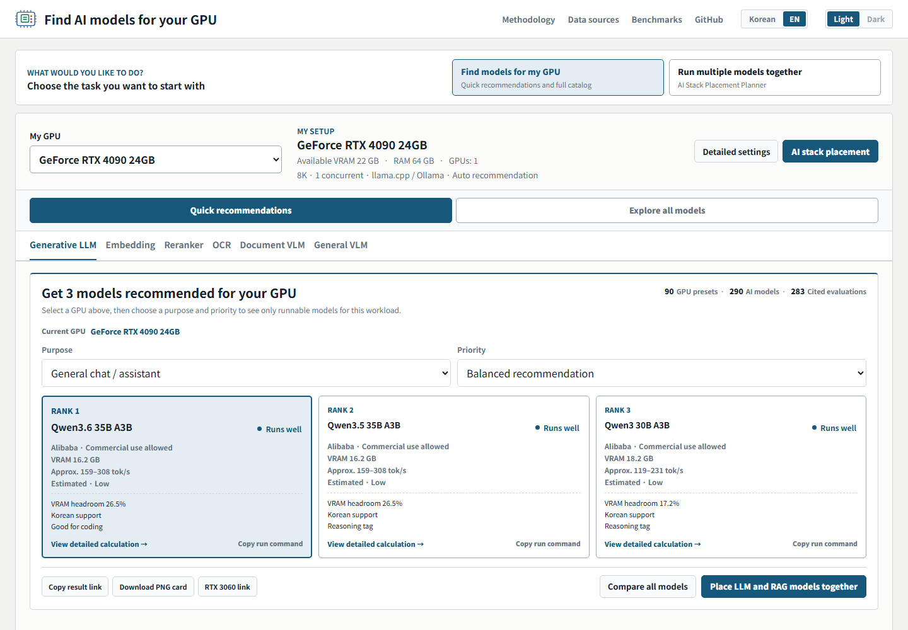
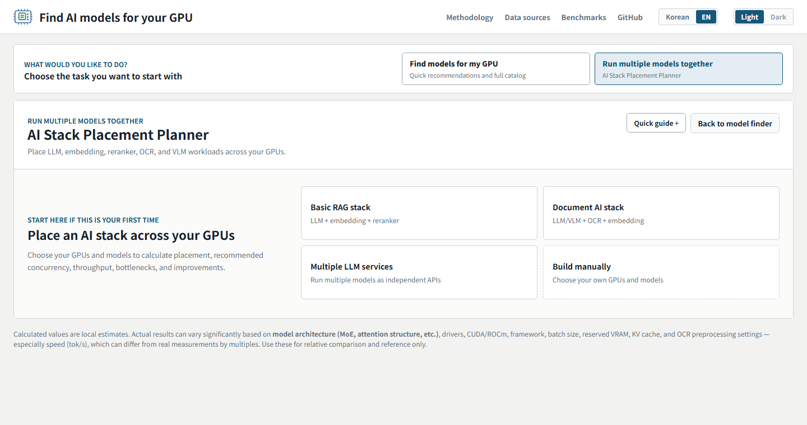

# AI Hardware Fit

  

  <strong>Compare the LLM, embedding, reranker, OCR, and VLM workloads your GPU can run by VRAM, throughput, quality references, and licensing.</strong>

  
  
  

  <a href="https://jaeseok614.github.io/llm-gpu-checker-ko/?lang=en"><strong>Find models for your GPU</strong></a>
  · <a href="https://jaeseok614.github.io/llm-gpu-checker-ko/?mode=placement&amp;lang=en"><strong>AI Stack Placement</strong></a>
  · <a href="./docs/methodology.md">Methodology</a>
  · <a href="./README.md">한국어</a>
  · <a href="https://github.com/jaeseok614/llm-gpu-checker-ko/issues/new?template=benchmark-report.yml">Report a benchmark</a>

## Why this project?

- Parameter count alone does not tell you whether a model will run well.
- Context length, quantization, concurrency, runtime, and VRAM headroom all matter.
- LLM, RAG, and document-AI components belong in one planning view.

## Highlights

- 90 GPU presets and 290 AI models
- Six workloads: generative LLM, embedding, reranker, OCR, document VLM, and general VLM
- Side-by-side comparison for two or three models, plus heterogeneous and multi-GPU placement
- AI Stack Placement Planner: compare balanced, throughput, and primary-first plans side by side, with pipeline, independent-service, or one-at-a-time usage, target concurrency, and primary-model priority
- Light/dark mode with automatic system-preference detection and a saved choice
- Benchmark sheet metric picker that auto-compares only models measured on the same metric
- Source-linked representative public evaluations and plain-language license guidance
- Direct calculation for public Hugging Face models and a local benchmark CLI

## Choose your starting point

| Goal | Start here |
| --- | --- |
| Find a model that fits one GPU | [Model Finder](https://jaeseok614.github.io/llm-gpu-checker-ko/?lang=en) |
| Place an LLM, embedding, reranker, OCR, or VLM stack together | [AI Stack Placement](https://jaeseok614.github.io/llm-gpu-checker-ko/?mode=placement&lang=en) |

### Find models for your GPU

1. Select your GPU.
2. Select a workload.
3. Review the models and recommended settings that fit.
4. Open a model to inspect the VRAM and throughput basis and its license.

## Running multiple models together

[Open the AI Stack Placement Planner](https://jaeseok614.github.io/llm-gpu-checker-ko/?mode=placement&lang=en)

Use the planner when an LLM, embedding model, reranker, OCR pipeline, or VLM must share the same hardware:

1. Start from the RAG, document AI, or multiple-LLM preset—or build manually.
2. Add the GPUs you own and their quantities.
3. Search for the models that will run together.
4. Choose pipeline, independent services, or one-at-a-time operation.
5. Compare balanced, throughput, and primary-first plans, then review bottlenecks and suggested changes.

The planner reports model and precision placement by GPU, recommended concurrency, estimated total throughput, remaining VRAM, target shortfalls, and deployment-command drafts.
Open `Quick guide` in the planner header to review the workflow and usage-pattern definitions without leaving the app.

| Usage pattern | Choose it when |
| --- | --- |
| Pipeline | One request passes through several models, such as embedding → reranker → LLM |
| Independent services | Each model has its own API and users |
| One at a time | Several models stay installed, but only one runs at a time |

For a first run, start with `Basic RAG stack → Balanced → target 4`, then follow the bottleneck suggestions in the result.

## Typical questions

| Question | What to do |
| --- | --- |
| Which LLMs run on an RTX 3060? | Select the RTX 3060 and open the generative LLM list |
| Can an RTX 4090 host an LLM, embedding model, and reranker together? | Open AI Stack Placement and choose the basic RAG stack |
| How should I serve on several A100 GPUs? | Select the A100 and GPU count, then inspect concurrency capacity |
| How do document VLMs compare on VRAM and throughput? | Compare two or three models in the document VLM tab |

## About the numbers

VRAM and throughput are calculated estimates and can differ from a real deployment. The project keeps values with different evidence levels separate:

- **Calculated estimate:** VRAM, speed, and throughput produced by this project's formulas
- **External public reference:** Quality evaluations and reference figures from model cards, papers, or official posts
- **User measurement:** A user-submitted result with reproducible conditions and a source
- **Project measurement:** A result measured directly by this project under controlled conditions

External web figures are never labeled as user or project measurements. Speed calibration requires a matching GPU, model, quantization, runtime, and input/output length.

## Documentation

- [Calculation methodology](./docs/methodology.md)
- [Accuracy and limitations](./docs/accuracy-and-limits.md)
- [Data sources](./docs/data-sources.md)
- [Contributing](./CONTRIBUTING.md)
- [Changelog](./CHANGELOG.md)

Run `npm install` and `npm run check` for local validation. Repository code is distributed under the [MIT License](./LICENSE); every listed AI model retains its own license.
