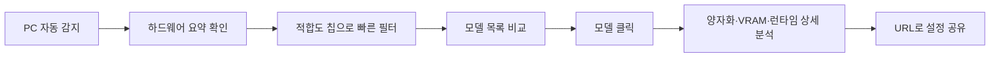
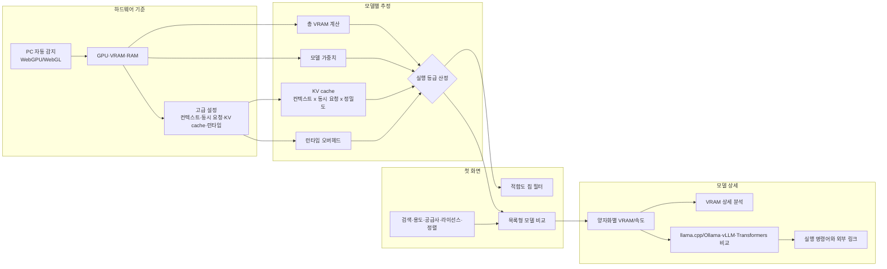
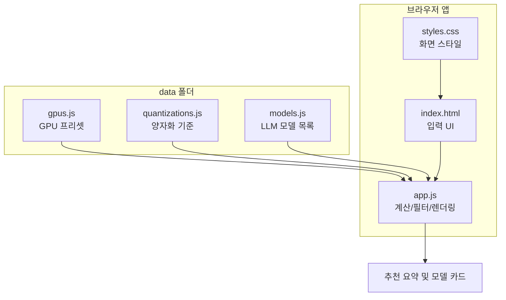

# LLM GPU Checker

<p align="center">
  
</p>

<p align="center">
  <strong>내 GPU에서 어떤 LLM을 현실적으로 실행할 수 있는지 확인하세요.</strong><br />
  Korean web-based LLM GPU compatibility and VRAM calculator.
</p>

<p align="center">
  <a href="https://jaeseok614.github.io/llm-gpu-checker-ko/"><strong>웹에서 바로 사용하기</strong></a>
  ·
  <a href="#계산-기준">계산 기준 보기</a>
  ·
  <a href="https://github.com/jaeseok614/llm-gpu-checker-ko/issues/new/choose">모델·GPU 추가 요청</a>
</p>

<p align="center">
  
  
  
  
</p>


## 10초 사용 흐름



## 대표 사용 사례

| 질문 | 앱에서 확인할 값 |
| --- | --- |
| RTX 3060 12GB에서 Qwen 계열 모델은 어디까지 가능할까? | `GeForce RTX 3060 12GB`, `한국어`, `Qwen` 검색 |
| RTX 4090 24GB로 32B Q4 모델을 돌릴 수 있을까? | `GeForce RTX 4090 24GB`, `Q4_K_M`, `32B` 검색 |
| Mac 32GB에서 로컬 LLM은 어느 정도까지 가능할까? | Apple Silicon 프리셋 선택 후 VRAM/RAM 직접 조정 |
| A100 80GB 2장으로 동시 요청을 몇 개 처리할 수 있을까? | `A100 80GB`, `GPU 수 2`, `동시 요청` 변경 |

## 지원 규모

| 데이터 | 개수 |
| --- | ---: |
| GPU 프리셋 | 86 |
| LLM 모델 | 114 |
| 양자화 옵션 | 8 |
| 모델 공급사 | 22 |
| 비전/멀티모달 모델 | 19 |

## 주요 기능

| 기능 | 설명 |
| --- | --- |
| GPU 프리셋 | GeForce RTX, RTX Pro/Quadro, NVIDIA 데이터센터, AMD, Intel, Apple Silicon 포함 |
| PC 자동 감지 | WebGPU/WebGL로 감지한 GPU 이름을 프리셋과 자동 매칭 |
| 직접 입력 | VRAM, GPU 수, 시스템 RAM, 대역폭 직접 조정 |
| 서빙 조건 | 컨텍스트 길이, 동시 요청 수, 평균 출력 토큰, KV cache 정밀도 선택 |
| 양자화 선택 | 자동 추천, Q2/Q3/Q4/Q5/Q6/Q8/FP16 |
| 실행 등급 | 쾌적, 잘 돌아감, 가능, 빡빡함, 오프로딩, 부적합 |
| 빠른 목록 | 모델명, 등급, 권장 양자화, 필요 VRAM, 예상 속도, 컨텍스트를 한 줄로 비교 |
| 상세 분석 | 모델 클릭 시 양자화별 비교, VRAM 구성, 실행 방식별 속도, 예시 명령어 표시 |
| 모델 필터 | 한국어, 코딩, 추론, 긴 문서, 비전/멀티모달, 일반 챗봇 |
| 공급사 필터 | Meta, Google, Alibaba, DeepSeek, Mistral AI, Microsoft 등 공급사별 필터 |
| 라이선스 필터 | Apache 2.0, MIT, Llama, Gemma, MRL 등 라이선스별 필터 |
| 정렬 | 추천순, 예상 속도순, 품질 우선, 필요 VRAM 낮은 순, 파라미터 큰 순, 최신 모델순 |
| URL 상태 저장 | GPU, VRAM, RAM, 컨텍스트, 동시 요청, 필터, 선택 모델을 쿼리 파라미터로 공유 |

## 화면 흐름



## 계산 기준

필요 VRAM은 아래 요소를 합산해 추정합니다.

```text
필요 VRAM = 모델 가중치 + KV cache + 런타임 오버헤드
```

| 항목 | 의미 |
| --- | --- |
| 모델 가중치 | 파라미터 수와 양자화별 byte/parameter 기준으로 계산 |
| KV cache | 활성 파라미터, 컨텍스트 길이, 동시 요청 수, KV 정밀도에 따라 증가 |
| 런타임 오버헤드 | llama.cpp/Ollama, vLLM, Transformers별 기본 여유분 |
| 평균 출력 토큰 | 요청당 예상 응답 시간 계산에 사용 |
| 오프로딩 | VRAM을 초과하지만 RAM 보조로 가능한 경우 별도 등급 표시 |

| 등급 | 의미 |
| --- | --- |
| 쾌적 | 여유 VRAM이 커서 안정적 |
| 잘 돌아감 | 일반적인 로컬 추론에 적합 |
| 가능 | 실행 가능하지만 설정 여유가 작음 |
| 빡빡함 | 컨텍스트/동시 요청/배치 축소 권장 |
| 오프로딩 | RAM 보조가 필요하고 속도 저하 예상 |
| 부적합 | 현재 입력 조건으로는 권장하지 않음 |

## 실제 실행 검증

계산기는 추정 도구입니다. 실제 벤치마크가 쌓일수록 정확도가 좋아집니다. 실행 결과가 있다면 [Benchmark report](https://github.com/jaeseok614/llm-gpu-checker-ko/issues/new?template=benchmark-report.yml)로 제보해 주세요.

| GPU | 모델 | 설정 | 계산기 결과 | 실제 결과 |
| --- | --- | --- | --- | --- |
| RTX 4090 24GB | Qwen2.5 32B Instruct | Q4, 8K, 동시 1명 | 가능 | 제보 대기 |
| RTX 3060 12GB | Llama 3.1 8B Instruct | Q4, 4K, 동시 1명 | 가능 | 제보 대기 |
| A100 80GB x2 | Llama 3.3 70B Instruct | Q4, 16K, 동시 4명 | 잘 돌아감 | 제보 대기 |

## 데이터 구조



## 로컬 실행

브라우저에서 `index.html`을 직접 열면 됩니다. 로컬 서버로 확인하려면:

```bash
python3 -m http.server 8787
```

```text
http://127.0.0.1:8787
```

## 데이터 추가

`data/models.js`에 아래 형식으로 항목을 추가하면 됩니다.

```js
{
  name: "Example 14B Instruct",
  maker: "Example",
  params: 14,
  active: 14,
  context: 32,
  license: "Apache 2.0",
  tags: ["general", "korean"],
  summary: "모델 카드에 표시될 한국어 설명입니다.",
}
```

지원 태그:

```text
general, korean, coding, reasoning, long, edge, vision
```

## 검증

Node.js가 있으면 문법과 데이터 구조를 확인할 수 있습니다.

```bash
npm run check
```

## 정확도와 한계

브라우저는 보안상 `nvidia-smi`처럼 정확한 VRAM, 드라이버, GPU 점유율을 직접 읽을 수 없습니다. `PC 자동 감지`는 WebGPU/WebGL이 공개하는 GPU 이름을 기반으로 프리셋을 추정 매칭하고, 매칭된 프리셋의 VRAM/대역폭 값을 입력란에 채우는 방식입니다.

실제 실행 가능 여부와 속도는 드라이버, CUDA/ROCm, 런타임, 모델 구현, KV cache precision, 배치 크기, CPU/RAM 성능에 따라 달라질 수 있습니다.

## 기여

- 모델 추가: [Model request](https://github.com/jaeseok614/llm-gpu-checker-ko/issues/new?template=model-request.yml)
- GPU 추가: [GPU request](https://github.com/jaeseok614/llm-gpu-checker-ko/issues/new?template=gpu-request.yml)
- 벤치마크 제보: [Benchmark report](https://github.com/jaeseok614/llm-gpu-checker-ko/issues/new?template=benchmark-report.yml)

자세한 방식은 [CONTRIBUTING.md](./CONTRIBUTING.md)를 참고하세요.

## 라이선스

[MIT License](./LICENSE)

## GPU 스펙 데이터

GPU 목록과 스펙 원천 데이터는 **[gpu-specs-kr](https://github.com/jaeseok614/gpu-specs-kr)** 프로젝트에서 관리합니다.

> Wikipedia의 NVIDIA·AMD·Intel GPU 스펙을 정규화한 오픈소스 데이터셋·REST API

- JSON · CSV · SQLite 다운로드 가능
- 1,833개 GPU (NVIDIA 959 / AMD 870 / Intel 4)
- [데이터셋 바로가기 →](https://github.com/jaeseok614/gpu-specs-kr)
