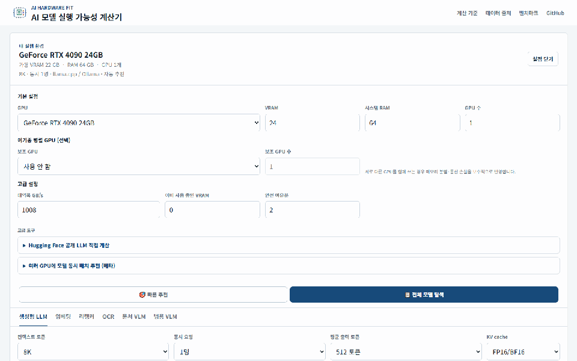

# AI Hardware Fit

  

  <strong>내 GPU에서 실행 가능한 LLM·임베딩·리랭커·OCR·VLM을 VRAM, 속도, 품질, 라이선스 기준으로 비교합니다.</strong>

  <a href="https://jaeseok614.github.io/llm-gpu-checker-ko/"><strong>웹에서 사용하기</strong></a>
  · <a href="./docs/methodology.md">계산 기준</a>
  · <a href="./README.en.md">English</a>
  · <a href="https://github.com/jaeseok614/llm-gpu-checker-ko/issues/new?template=benchmark-report.yml">벤치마크 제보</a>

## 왜 만들었나요?

- 모델 파라미터만으로는 실제 실행 가능 여부를 판단하기 어렵습니다.
- 컨텍스트, 양자화, 동시 요청, 런타임과 여유 VRAM을 함께 고려합니다.
- LLM뿐 아니라 RAG와 문서 AI 구성 요소도 한곳에서 비교합니다.

## 주요 기능

- GPU 프리셋 90개, AI 모델 286개
- 생성형 LLM·임베딩·리랭커·OCR·문서 VLM·범용 VLM 6개 워크로드
- 모델 2~3개 비교와 이기종·다중 GPU 배치
- 빠른 추천 결과 링크 공유와 PNG 요약 카드 다운로드
- 출처가 연결된 대표 공개 평가와 한국어 라이선스 이용 조건
- Hugging Face 공개 모델 직접 계산과 로컬 벤치마크 CLI
- 첫 실측 10개 수집 계획: [benchmark-first-10.md](docs/benchmark-first-10.md)

## 30초 사용법

1. GPU를 선택합니다.
2. 모델 종류를 선택합니다.
3. 실행 가능한 모델과 권장 설정을 확인합니다.
4. 모델 상세에서 VRAM·속도 계산 근거와 라이선스를 확인합니다.

## 대표 사용 사례

| 확인할 내용 | 앱에서 할 일 |
| --- | --- |
| RTX 3060에서 실행 가능한 LLM | RTX 3060 선택 후 생성형 LLM 목록 확인 |
| RTX 4090에 LLM+임베딩+리랭커 동시 배치 | 여러 GPU 모델 배치에서 세 워크로드를 함께 선택 |
| A100 여러 장을 이용한 서빙 | A100과 GPU 수를 지정하고 동시 처리 용량 확인 |
| 문서 VLM의 VRAM과 처리량 비교 | 문서 VLM 탭에서 모델 2~3개 비교 |

## 계산값 안내

속도와 VRAM은 계산 추정치이며 실제 환경에 따라 달라질 수 있습니다. 앱과 데이터에서는 근거가 다른 값을 섞지 않습니다.

- **계산 추정:** 프로젝트 계산식으로 산출한 VRAM·속도·처리량
- **외부 공개 참고값:** 모델 카드·논문·공식 발표의 품질 평가와 참고 기준
- **사용자 측정:** 재현 조건과 출처가 확인된 사용자 제보
- **자체 측정:** 프로젝트가 직접 같은 조건에서 측정한 값

외부에서 찾은 수치는 사용자 측정이나 자체 측정으로 표시하지 않습니다. 속도 보정에는 GPU·모델·양자화·런타임·입출력 길이가 모두 확인되는 측정만 사용합니다.

## 문서

- [계산 방법](./docs/methodology.md)
- [정확도와 한계](./docs/accuracy-and-limits.md)
- [데이터 출처](./docs/data-sources.md)
- [기여 방법](./CONTRIBUTING.md)
- [변경 이력](./CHANGELOG.md)

로컬 검증은 `npm install` 후 `npm run check`로 실행합니다. 저장소 코드는 [MIT License](./LICENSE)를 따르며, 수록된 AI 모델은 각 모델의 별도 라이선스를 따릅니다.
