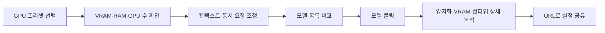
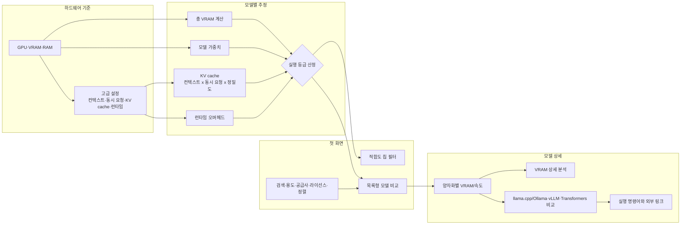
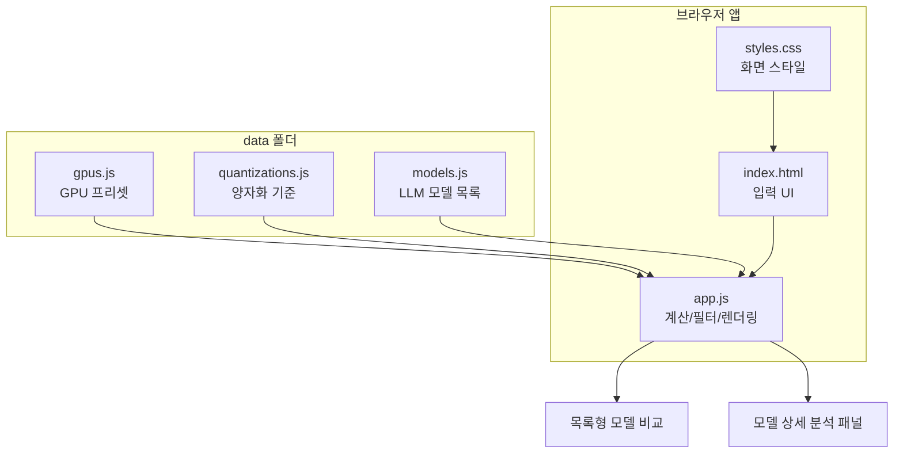

# LLM GPU Checker

<p align="center">
  
</p>

<p align="center">
  <strong>내 GPU에서 어떤 LLM을 현실적으로 실행할 수 있는지 확인하세요.</strong><br />
  Korean web-based LLM GPU compatibility and VRAM calculator.
</p>

<p align="center">
  <a href="https://jaeseok614.github.io/llm-gpu-checker-ko/"><strong>웹에서 바로 사용하기</strong></a>
  ·
  <a href="#계산-기준">계산 기준 보기</a>
  ·
  <a href="https://github.com/jaeseok614/llm-gpu-checker-ko/issues/new/choose">모델·GPU 추가 요청</a>
</p>

<p align="center">
  
  
  
  
</p>


## 10초 사용 흐름



## 대표 사용 사례

| 질문 | 앱에서 확인할 값 |
| --- | --- |
| RTX 3060 12GB에서 Qwen 계열 모델은 어디까지 가능할까? | `GeForce RTX 3060 12GB`, `한국어`, `Qwen` 검색 |
| RTX 4090 24GB로 32B Q4 모델을 돌릴 수 있을까? | `GeForce RTX 4090 24GB`, `Q4_K_M`, `32B` 검색 |
| Mac 32GB에서 로컬 LLM은 어느 정도까지 가능할까? | Apple Silicon 프리셋 선택 후 VRAM/RAM 직접 조정 |
| A100 80GB 2장으로 동시 요청을 몇 개 처리할 수 있을까? | `A100 80GB`, `GPU 수 2`, `동시 요청` 변경 |

## 지원 규모

| 데이터 | 개수 |
| --- | ---: |
| GPU 프리셋 | 86 |
| LLM 모델 | 114 |
| 양자화 옵션 | 8 |
| 모델 공급사 | 22 |
| 비전/멀티모달 모델 | 19 |

## 주요 기능

| 기능 | 설명 |
| --- | --- |
| GPU 프리셋 | GeForce RTX, RTX Pro/Quadro, NVIDIA 데이터센터, AMD, Intel, Apple Silicon 포함 |
| 직접 입력 | VRAM, GPU 수, 시스템 RAM, 대역폭 직접 조정 |
| 서빙 조건 | 컨텍스트 길이, 동시 요청 수, 평균 출력 토큰, KV cache 정밀도 선택 |
| 양자화 선택 | 자동 추천, Q2/Q3/Q4/Q5/Q6/Q8/FP16 |
| 실행 등급 | 쾌적, 잘 돌아감, 가능, 빡빡함, 오프로딩, 부적합 |
| 빠른 목록 | 모델명, 등급, 권장 양자화, 필요 VRAM, 예상 속도, 컨텍스트를 한 줄로 비교 |
| 상세 분석 | 모델 클릭 시 양자화별 비교, VRAM 구성, 실행 방식별 속도, 예시 명령어 표시 |
| 모델 필터 | 한국어, 코딩, 추론, 긴 문서, 비전/멀티모달, 일반 챗봇 |
| 공급사 필터 | Meta, Google, Alibaba, DeepSeek, Mistral AI, Microsoft 등 공급사별 필터 |
| 라이선스 필터 | Apache 2.0, MIT, Llama, Gemma, MRL 등 라이선스별 필터 |
| 정렬 | 추천순, 예상 속도순, 품질 우선, 필요 VRAM 낮은 순, 파라미터 큰 순, 최신 모델순 |
| URL 상태 저장 | GPU, VRAM, RAM, 컨텍스트, 동시 요청, 필터, 선택 모델을 쿼리 파라미터로 공유 |

## 화면 흐름



## 계산 기준

### Methodology, Formula-Oriented

This calculator uses a deterministic heuristic model. It estimates whether a local LLM can fit into the selected hardware budget under a given quantization, context length, concurrency, output length, KV cache precision, and runtime backend.

#### Notation

| Symbol | Meaning |
| --- | --- |
| `P` | Total model parameters in billions |
| `A` | Active parameters per token in billions, especially relevant for MoE models |
| `b_q` | Bytes per parameter for quantization `q` |
| `C` | Selected context length in tokens |
| `C_max` | Model maximum context length in tokens |
| `N` | Concurrent requests |
| `O` | Average generated output tokens per request |
| `k` | KV cache precision factor |
| `G` | Number of GPUs |
| `V` | VRAM per GPU in GB |
| `R` | System RAM in GB |
| `B` | Memory bandwidth in GB/s |

#### Memory Model

The model weight footprint is approximated as:

$$
M_{weights} = P \cdot b_q \cdot 1.08
$$

The `1.08` multiplier covers metadata, tensor layout overhead, and practical loader overhead. The calculator uses decimal GB-style estimation, where 1B parameters at 1 byte per parameter is treated as roughly 1 GB.

The KV cache grows with active parameters, context length, concurrency, and KV precision:

$$
M_{KV} = A \cdot 0.09 \cdot \frac{C}{4096} \cdot N \cdot k
$$

KV precision factors:

| KV precision | `k` |
| --- | ---: |
| FP16/BF16 | `1.00` |
| FP8 | `0.55` |
| Q8 | `0.60` |
| Q4 | `0.35` |

Runtime overhead is modeled per backend:

$$
M_{runtime} = base_r + \min(cap_r,\alpha_r \cdot M_{weights}) + \max(0,N-1)\cdot \beta_r
$$

| Runtime | `base_r` | `cap_r` | `alpha_r` | `beta_r` |
| --- | ---: | ---: | ---: | ---: |
| llama.cpp / Ollama | `1.2` | `3.0` | `0.06` | `0.08` |
| vLLM | `2.6` | `5.5` | `0.10` | `0.12` |
| Transformers | `2.2` | `4.5` | `0.09` | `0.18` |

Total estimated VRAM:

$$
M_{required} = M_{weights} + M_{KV} + M_{runtime}
$$

Effective GPU memory:

$$
M_{effective} =
\begin{cases}
V \cdot G, & G = 1 \\
V \cdot G \cdot 0.92, & G > 1
\end{cases}
$$

The multi-GPU `0.92` factor approximates memory loss from sharding, communication buffers, and uneven placement.

#### Fit Grade

First, the selected context must fit the model limit:

$$
C \le C_{max}
$$

Then the memory pressure ratio is:

$$
\rho = \frac{M_{required}}{M_{effective}}
$$

Offload room includes partial use of system RAM:

$$
M_{offload} = M_{effective} + 0.45R
$$

| Grade | Condition |
| --- | --- |
| `S` 쾌적 | `rho <= 0.70` |
| `A` 잘 돌아감 | `0.70 < rho <= 0.85` |
| `B` 가능 | `0.85 < rho <= 1.00` |
| `C` 빡빡함 | `1.00 < rho <= 1.12` |
| `D` 오프로딩 | `M_required <= M_offload` |
| `F` 부적합 | Context overflow or memory exceeds offload room |

#### Throughput and Response-Time Model

The token throughput estimate is bandwidth-oriented:

$$
T_{raw} =
\frac{B \cdot G \cdot m_G \cdot m_r}
{\max(A \cdot b_q, 1)\cdot 4}
$$

Runtime and multi-GPU multipliers:

| Factor | Value |
| --- | --- |
| `m_G` | `1.00` for single GPU, `0.76` for multi-GPU |
| `m_r` | `1.00` llama.cpp/Ollama, `1.10` vLLM, `0.78` Transformers |

Offload and tight-memory penalty:

| Grade | `p_fit` |
| --- | ---: |
| `S/A/B` | `1.00` |
| `C` | `0.55` |
| `D` | `0.22` |
| `F` | `0.00` |

Backend concurrency efficiency:

| Runtime | `eta_r` |
| --- | ---: |
| llama.cpp / Ollama | `0.55` |
| vLLM | `0.78` |
| Transformers | `0.38` |

Total and per-request throughput:

$$
T_{total}=T_{raw}\cdot(1+(N-1)\eta_r)\cdot p_{fit}
$$

$$
T_{request}=\frac{T_{total}}{N}
$$

Average generation latency is derived from output length:

$$
L_{generation}=\frac{O}{T_{request}}
$$

Estimated time to first token:

$$
L_{first}=
\left(0.18+\min(5,0.025A)+0.08\frac{C}{8192}+0.025\max(0,N-1)\right)
\cdot u_r \cdot u_{fit}
$$

| Runtime | `u_r` |
| --- | ---: |
| llama.cpp / Ollama | `1.00` |
| vLLM | `0.85` |
| Transformers | `1.20` |

| Grade | `u_fit` |
| --- | ---: |
| `S/A/B` | `1.00` |
| `C` | `1.60` |
| `D` | `2.40` |

#### Auto Quantization Policy

When quantization is set to `자동 추천`, the calculator searches from higher quality to lower quality:

$$
q \in \{Q6\_K,\ Q5\_K\_M,\ Q4\_K\_M,\ Q3\_K\_M,\ Q2\_K\}
$$

The first quantization that satisfies the memory budget is selected:

$$
M_{required}(q) \le 0.85M_{effective}
$$

If no option satisfies that comfortable threshold, the calculator tries:

$$
M_{required}(q) \le M_{effective}
$$

and then:

$$
M_{required}(q) \le M_{offload}
$$

If all checks fail, `Q2_K` is used as the last possible comparison baseline.

### 쉬운 설명

| 항목 | 의미 |
| --- | --- |
| 모델 가중치 | 모델 자체를 GPU에 올리는 데 필요한 메모리입니다. 모델이 클수록 커지고, Q4/Q5/Q6 같은 양자화가 낮을수록 줄어듭니다. |
| 컨텍스트 길이 | 한 번에 읽을 수 있는 텍스트 길이입니다. 8K보다 32K가 더 많은 메모리를 씁니다. 긴 문서/RAG를 돌릴수록 이 값이 중요합니다. |
| 동시 요청 수 | 동시에 몇 명이 쓰는지입니다. 1명보다 4명, 8명이 훨씬 많은 KV cache를 씁니다. |
| KV cache | 모델이 긴 대화와 문맥을 기억하기 위해 잡아두는 작업 메모리입니다. 컨텍스트 길이, 동시 요청 수, KV 정밀도에 비례해서 커집니다. |
| 평균 출력 토큰 | 답변을 평균 몇 토큰까지 생성할지입니다. VRAM 적합도보다는 “답변이 몇 초 걸릴지” 계산에 사용됩니다. |
| 런타임 오버헤드 | Ollama, llama.cpp, vLLM, Transformers가 모델 외에 추가로 쓰는 여유 메모리입니다. vLLM은 동시 처리에 강하지만 기본 오버헤드가 더 큽니다. |
| 시스템 RAM 보조 | VRAM에 딱 안 들어가도 RAM 오프로딩으로 가능할 수 있습니다. 대신 속도는 크게 느려질 수 있습니다. |

쉽게 보면 계산기는 아래 순서로 판단합니다.

```text
1. 선택한 컨텍스트 길이가 모델 한도를 넘는지 확인
2. 모델 가중치 + KV cache + 런타임 오버헤드를 더해 필요 VRAM 계산
3. 내 GPU의 실제 사용 가능 VRAM과 비교
4. 부족하면 시스템 RAM 오프로딩 가능성 확인
5. 메모리 여유와 예상 속도를 같이 보고 등급 결정
```

가장 많이 영향을 주는 값은 보통 아래 네 가지입니다.

| 사용자가 바꾸는 값 | 결과에 미치는 영향 |
| --- | --- |
| 양자화 | Q6/Q5는 품질이 좋지만 VRAM을 더 쓰고, Q4/Q3/Q2는 더 가볍지만 품질 손실이 커질 수 있습니다. |
| 컨텍스트 길이 | 길수록 긴 문서를 잘 다루지만 KV cache가 커져 VRAM을 더 씁니다. |
| 동시 요청 수 | 동시에 여러 명이 쓰면 요청당 속도는 줄고 KV cache는 커집니다. |
| 실행 방식 | Ollama/llama.cpp는 가볍고 단순한 편이고, vLLM은 서버형 동시 처리에 유리하며, Transformers는 범용성이 높지만 오버헤드가 다를 수 있습니다. |

| 등급 | 의미 |
| --- | --- |
| 쾌적 | 여유 VRAM이 커서 안정적 |
| 잘 돌아감 | 일반적인 로컬 추론에 적합 |
| 가능 | 실행 가능하지만 설정 여유가 작음 |
| 빡빡함 | 컨텍스트/동시 요청/배치 축소 권장 |
| 오프로딩 | RAM 보조가 필요하고 속도 저하 예상 |
| 부적합 | 현재 입력 조건으로는 권장하지 않음 |

## 실제 실행 검증

계산기는 추정 도구입니다. 실제 벤치마크가 쌓일수록 정확도가 좋아집니다. 실행 결과가 있다면 [Benchmark report](https://github.com/jaeseok614/llm-gpu-checker-ko/issues/new?template=benchmark-report.yml)로 제보해 주세요.

| GPU | 모델 | 설정 | 계산기 결과 | 실제 결과 |
| --- | --- | --- | --- | --- |
| RTX 4090 24GB | Qwen2.5 32B Instruct | Q4, 8K, 동시 1명 | 가능 | 제보 대기 |
| RTX 3060 12GB | Llama 3.1 8B Instruct | Q4, 4K, 동시 1명 | 가능 | 제보 대기 |
| A100 80GB x2 | Llama 3.3 70B Instruct | Q4, 16K, 동시 4명 | 잘 돌아감 | 제보 대기 |

## 데이터 구조



## 로컬 실행

브라우저에서 `index.html`을 직접 열면 됩니다. 로컬 서버로 확인하려면:

```bash
python3 -m http.server 8787
```

```text
http://127.0.0.1:8787
```

## 데이터 추가

`data/models.js`에 아래 형식으로 항목을 추가하면 됩니다.

```js
{
  name: "Example 14B Instruct",
  maker: "Example",
  params: 14,
  active: 14,
  context: 32,
  license: "Apache 2.0",
  tags: ["general", "korean"],
  summary: "모델 카드에 표시될 한국어 설명입니다.",
}
```

지원 태그:

```text
general, korean, coding, reasoning, long, edge, vision
```

## 검증

Node.js가 있으면 문법과 데이터 구조를 확인할 수 있습니다.

```bash
npm run check
```

## 정확도와 한계

브라우저는 보안상 `nvidia-smi`처럼 정확한 VRAM, 드라이버, GPU 점유율을 직접 읽을 수 없습니다. 그래서 이 계산기는 자동 감지 대신 GPU 프리셋 선택과 직접 입력값을 기준으로 계산합니다.

실제 실행 가능 여부와 속도는 드라이버, CUDA/ROCm, 런타임, 모델 구현, KV cache precision, 배치 크기, CPU/RAM 성능에 따라 달라질 수 있습니다.

## 기여

- 모델 추가: [Model request](https://github.com/jaeseok614/llm-gpu-checker-ko/issues/new?template=model-request.yml)
- GPU 추가: [GPU request](https://github.com/jaeseok614/llm-gpu-checker-ko/issues/new?template=gpu-request.yml)
- 벤치마크 제보: [Benchmark report](https://github.com/jaeseok614/llm-gpu-checker-ko/issues/new?template=benchmark-report.yml)

자세한 방식은 [CONTRIBUTING.md](./CONTRIBUTING.md)를 참고하세요.

## 라이선스

[MIT License](./LICENSE)

## GPU 스펙 데이터

GPU 목록과 스펙 원천 데이터는 **[gpu-specs-kr](https://github.com/jaeseok614/gpu-specs-kr)** 프로젝트에서 관리합니다.

> Wikipedia의 NVIDIA·AMD·Intel GPU 스펙을 정규화한 오픈소스 데이터셋·REST API

- JSON · CSV · SQLite 다운로드 가능
- 1,833개 GPU (NVIDIA 959 / AMD 870 / Intel 4)
- [데이터셋 바로가기 →](https://github.com/jaeseok614/gpu-specs-kr)
