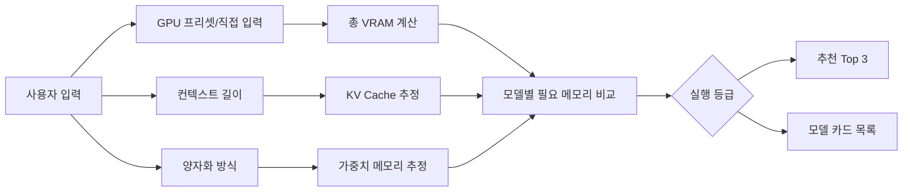
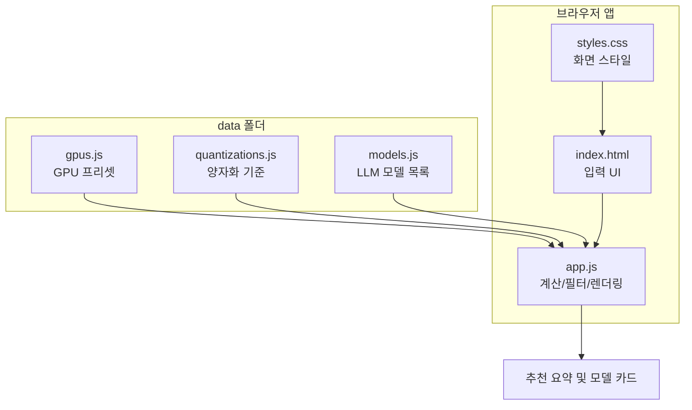

# LLM GPU 실행 가능성 계산기

<p align="center">
  
</p>

<p align="center">
  <strong>내 GPU에서 어떤 LLM을 현실적으로 돌릴 수 있는지 한국어로 빠르게 확인하는 정적 웹앱</strong>
</p>

<p align="center">
  
  
  
  
</p>


## 개요

GPU 프리셋, VRAM, 시스템 RAM, 메모리 대역폭, 컨텍스트 길이, 양자화 방식을 입력하면 모델별 실행 가능성을 등급으로 보여줍니다.

이 프로젝트는 설치 없이 열리는 정적 웹앱입니다. 모델/GPU 데이터는 코드에서 분리되어 있어 나중에 목록을 늘리기 쉽습니다.

## 바로 실행

브라우저에서 아래 파일을 직접 열면 됩니다.

```text
index.html
```

로컬 서버로 확인하려면:

```bash
python3 -m http.server 8787
```

```text
http://127.0.0.1:8787
```

## 주요 기능

| 기능 | 설명 |
| --- | --- |
| GPU 프리셋 | RTX 3060, RTX 4090, L4, L40S, A100, H100 등 기본 제공 |
| 직접 입력 | VRAM, GPU 수, 시스템 RAM, 대역폭 직접 조정 |
| 양자화 선택 | 자동 추천, Q2/Q3/Q4/Q5/Q6/Q8/FP16 |
| 실행 등급 | 쾌적, 잘 돌아감, 가능, 빡빡함, 오프로딩, 부적합 |
| 모델 필터 | 한국어, 코딩, 추론, 긴 문서, 일반 챗봇 |
| 정렬 | 실행 적합도, 모델 크기, 예상 속도 |
| WebGPU 감지 | 브라우저가 허용하는 범위에서 GPU 정보 감지 |

## 화면 흐름



## 구조

```text
llm_gpu_checker_ko/
├── assets/
│   └── gpu-board.svg
├── data/
│   ├── gpus.js
│   ├── models.js
│   └── quantizations.js
├── docs/
│   └── preview.svg
├── scripts/
│   └── validate-data.mjs
├── app.js
├── index.html
├── package.json
├── styles.css
└── README.md
```

## 데이터 구조



## 계산 기준

필요 VRAM은 아래 요소를 합산해 추정합니다.

```text
필요 VRAM = 모델 가중치 + KV cache + 런타임 오버헤드
```

| 항목 | 의미 |
| --- | --- |
| 모델 가중치 | 파라미터 수와 양자화별 byte/parameter 기준으로 계산 |
| KV cache | 활성 파라미터와 컨텍스트 길이에 따라 증가 |
| 런타임 오버헤드 | llama.cpp/Ollama, vLLM, Transformers별 기본 여유분 |
| 오프로딩 | VRAM을 초과하지만 RAM 보조로 가능한 경우 별도 등급 표시 |

등급은 총 VRAM 대비 필요 VRAM 비율을 기준으로 나눕니다.

| 등급 | 의미 |
| --- | --- |
| 쾌적 | 여유 VRAM이 커서 안정적 |
| 잘 돌아감 | 일반적인 로컬 추론에 적합 |
| 가능 | 실행 가능하지만 설정 여유가 작음 |
| 빡빡함 | 컨텍스트/배치 축소 권장 |
| 오프로딩 | RAM 보조가 필요하고 속도 저하 예상 |
| 부적합 | 현재 입력 조건으로는 권장하지 않음 |

## 모델 데이터 추가

`data/models.js`에 아래 형식으로 항목을 추가하면 됩니다.

```js
{
  name: "Example 14B Instruct",
  maker: "Example",
  params: 14,
  active: 14,
  context: 32,
  license: "Apache 2.0",
  tags: ["general", "korean"],
  summary: "모델 카드에 표시될 한국어 설명입니다.",
}
```

지원 태그:

```text
general, korean, coding, reasoning, long, edge
```

## 검증

Node.js가 있으면 문법과 데이터 구조를 확인할 수 있습니다.

```bash
npm run check
```

현재 기본 데이터:

| 데이터 | 개수 |
| --- | ---: |
| GPU 프리셋 | 12 |
| 양자화 옵션 | 8 |
| LLM 모델 | 20 |

## 주의사항

이 계산기는 로컬 추정 도구입니다. 실제 실행 가능 여부와 속도는 드라이버, CUDA/ROCm, 런타임, 모델 구현, KV cache precision, 배치 크기, CPU/RAM 성능에 따라 달라질 수 있습니다.

## 확장 계획

- Hugging Face, Ollama, vLLM 실행 명령 자동 생성
- 사용자가 모델/GPU를 추가하는 관리자 화면
- `nvidia-smi` 결과를 읽어 자동 입력하는 서버 API
- GitHub Pages 배포
- 실제 벤치마크 결과를 반영한 보정 계수 관리
