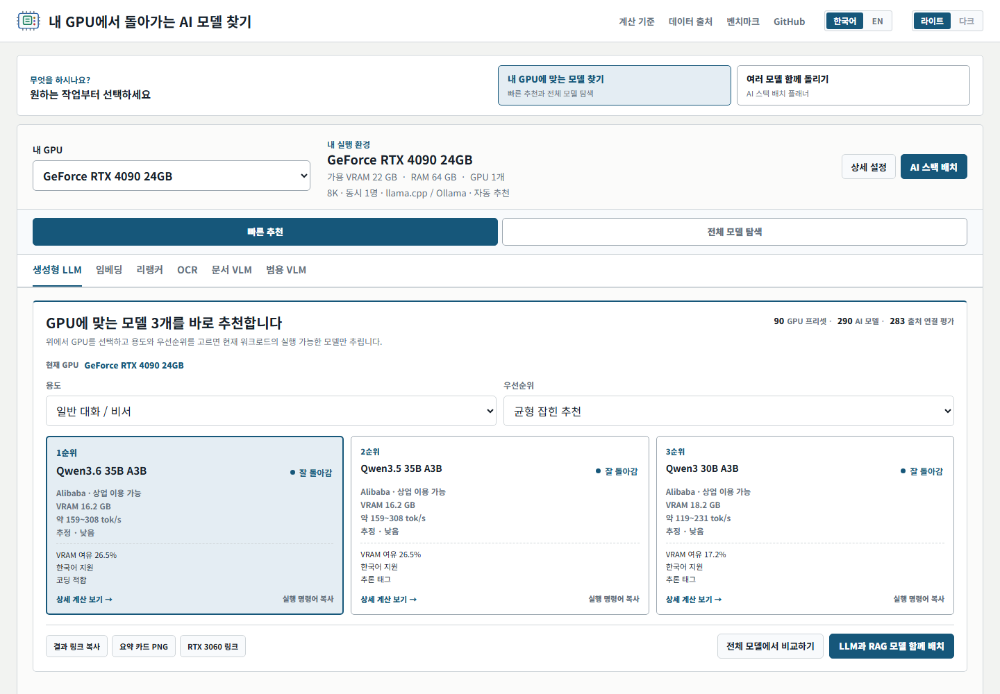

# AI Hardware Fit

<p align="center">
  
</p>

<p align="center">
  <strong>내 GPU에서 실행할 수 있는 LLM·임베딩·리랭커·OCR·이미지·비디오 생성 모델을<br />VRAM, 속도, 품질, 라이선스 기준으로 비교합니다.</strong>
</p>

<p align="center">
  <a href="https://github.com/jaeseok614/llm-gpu-checker-ko/actions/workflows/ci.yml"></a>
  <a href="./LICENSE"></a>
</p>

<p align="center">
  <a href="https://jaeseok614.github.io/llm-gpu-checker-ko/?lang=ko"><strong>웹에서 바로 사용</strong></a>
  · <a href="https://jaeseok614.github.io/llm-gpu-checker-ko/?mode=placement&amp;lang=ko">AI 스택 배치</a>
  · <a href="./README.en.md">English</a>
  · <a href="https://github.com/jaeseok614/llm-gpu-checker-ko/issues/new?template=gpu-request.yml">GPU 추가 요청</a>
</p>



## 주요 기능

- 데스크톱·데이터센터·Apple Silicon·노트북을 포함한 GPU 115종
- 생성형 LLM, 임베딩, 리랭커, OCR, 문서/범용 VLM, 이미지·비디오 생성, STT·TTS 워크로드
- GPU를 먼저 고르는 화면과 모델·예산을 먼저 고르는 전용 진입 화면
- GPU 상세 정보와 최대 3개 GPU 비교: VRAM, 대역폭, 실행 가능한 모델 수, 예상 속도
- 모델을 먼저 고른 뒤 예산·제조사·폼팩터·월 전력비로 GPU를 추천하는 GPU Advisor
- 노트북 GPU TGP 입력과 전력 제한에 따른 성능 보정
- 이미지/비디오 전용 계산 엔진: 해상도, 스텝, 프레임, FPS, LoRA, 오프로딩, Sage/Flash Attention, TeaCache 반영
- 동일 GPU·모델 조건의 사용자 측정값을 이용한 속도 보정과 신뢰도 표시
- 공식/추정 사양, 검증일, 측정 표본 수를 구분하는 데이터 품질 표시
- 실측 데이터·GPU·모델 범위와 우선 측정 대상을 보여주는 벤치마크 대시보드
- 여러 GPU에 여러 모델을 배치하는 AI 스택 배치 플래너
- 한국어/영어 UI, 반응형 모바일 화면, 키보드 포커스와 모션 감소 지원

## 자동화된 기여 파이프라인

GPU와 벤치마크 요청은 GitHub Issue로 받을 수 있습니다.

- [GPU 추가 요청](https://github.com/jaeseok614/llm-gpu-checker-ko/issues/new?template=gpu-request.yml): 공식 제조사 출처, 스키마, 중복, 노트북 TGP를 자동 검증하고 변경 미리보기와 데이터 PR을 만듭니다.
- [벤치마크 제보](https://github.com/jaeseok614/llm-gpu-checker-ko/issues/new?template=benchmark-report.yml): 측정 조건과 단위를 검증하고 `benchmark-ready` 라벨이 붙으면 데이터 PR을 만듭니다.
- [모델 추가 요청](https://github.com/jaeseok614/llm-gpu-checker-ko/issues/new?template=model-request.yml): 모델 카드·라이선스·중복을 검증하고 `model-ready` 라벨로 워크로드별 데이터 PR을 만듭니다.
- 모든 GPU 데이터는 제조사, 아키텍처, 메모리 종류, 사용 가능 메모리, 런타임, 폼팩터 필드를 공통 스키마로 검증합니다.
- GitHub Pages 빌드 시 커밋 해시를 정적 자산 버전에 넣어 오래된 브라우저 캐시를 방지합니다.

## 사용 방법

1. GPU를 선택합니다. 노트북 GPU라면 실제 TGP를 입력합니다.
2. 모델 종류와 실행 조건을 선택합니다.
3. 실행 가능 여부, 권장 정밀도, VRAM 구성, 예상 속도와 신뢰도를 확인합니다.
4. GPU 상세 패널에서 다른 GPU와 비교하거나, 여러 모델이라면 AI 스택 배치로 이동합니다.

수치는 하드웨어·런타임·드라이버·입력 데이터에 따라 달라지는 계산 추정치입니다. 외부 참고값, 사용자 측정값, 프로젝트 자체 측정값은 서로 구분해 표시합니다.

## 로컬 개발

Node.js 20 이상이 필요합니다.

```bash
npm install
npm run check
```

`npm run check`는 코드 문법, GPU/모델 데이터, 요청 자동화, 정적 빌드, 계산 테스트를 모두 검증합니다. `npm run build:static`의 결과는 `_site/`에 생성됩니다.

## 문서

- [계산 방법](./docs/methodology.md)
- [정확도와 한계](./docs/accuracy-and-limits.md)
- [데이터 출처](./docs/data-sources.md)
- [GPU 기여 파이프라인](./docs/gpu-contribution-pipeline.md)
- [v1.4 GPU Advisor 계산과 한계](./docs/v1.4-advisor-methodology.md)
- [v1.5 카탈로그·음성·대시보드](./docs/v1.5-catalog-audio-dashboard.md)
- [기여 방법](./CONTRIBUTING.md)
- [변경 이력](./CHANGELOG.md)

저장소 코드는 [MIT License](./LICENSE)를 따르며, 각 AI 모델은 해당 모델의 별도 라이선스를 따릅니다.
