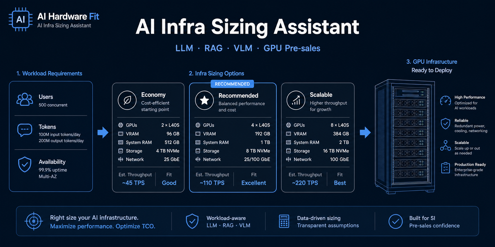

# AI Hardware Fit

<p align="center">
  
</p>

<p align="center">
  <strong>모델·트래픽·응답 목표를 GPU·CPU·RAM·스토리지·네트워크 구성안으로 변환하는<br />오픈소스 AI 인프라 사전 산정·견적 상담 도구</strong>
</p>

<p align="center">
  <a href="https://github.com/jaeseok614/llm-gpu-checker-ko/actions/workflows/ci.yml"></a>
  <a href="./LICENSE"></a>
</p>

<p align="center">
  <a href="https://jaeseok614.github.io/llm-gpu-checker-ko/?lang=ko"><strong>웹에서 바로 사용</strong></a>
  · <a href="https://jaeseok614.github.io/llm-gpu-checker-ko/?mode=infra&amp;lang=ko&amp;studio=consulting"><strong>AI 인프라 견적</strong></a>
  · <a href="https://jaeseok614.github.io/llm-gpu-checker-ko/?mode=placement&amp;lang=ko">AI 스택 배치</a>
  · <a href="https://jaeseok614.github.io/llm-gpu-checker-ko/?mode=apiCost&amp;lang=ko">API 비용 계산기</a>
  · <a href="./README.en.md">English</a>
  · <a href="https://github.com/jaeseok614/llm-gpu-checker-ko/issues/new?template=gpu-request.yml">GPU 추가 요청</a>
</p>

<p align="center">
  
</p>

<p align="center">
  <sub>워크로드 요구사항 입력 → 경제형·권장형·확장형 비교 → 인프라 구성안 산출</sub>
</p>

## 대표 사례 바로 열기

| 사례 | 바로 시작 |
| --- | --- |
| 사내 문서 RAG · 사용자 30명 | [간편 견적 열기](https://jaeseok614.github.io/llm-gpu-checker-ko/?mode=infra&lang=ko&studio=consulting&scenario=internal-rag&users=30) |
| 고객 상담 AI 챗봇 · 사용자 100명 | [간편 견적 열기](https://jaeseok614.github.io/llm-gpu-checker-ko/?mode=infra&lang=ko&studio=consulting&scenario=ai-chatbot&users=100) |
| 실시간 AI 아바타 채팅 · 사용자 50명 | [간편 견적 열기](https://jaeseok614.github.io/llm-gpu-checker-ko/?mode=infra&lang=ko&studio=consulting&scenario=avatar-chat&users=50) |

## 10초 요약

- **개발자·개인 사용자**: 내 GPU에서 실행할 수 있는 LLM·VLM·이미지·영상 모델을 찾습니다.
- **인프라 구축·MSP·서버 업체**: 고객의 모델·QPS·동시 요청·p95·가용성을 경제형·권장형·확장형 인프라 3안으로 변환합니다.
- **산출물**: 서버별 GPU·CPU·RAM·NVMe·NIC·전력·TCO, 모델 배치, 신뢰도, PoC 체크리스트, Excel·PDF·배포 초안.

> 이 프로젝트는 정확한 자동 견적이나 성능 보장을 제공하지 않습니다. 사전 산정·비교 검토·PoC 전 가설 수립을 지원하며 실제 구축 전 검증이 필요합니다.

⭐ 업무에 유용했다면 저장소에 Star를 눌러주시고, 실제 Pre-sales 사례에서 빠진 조건은 Issue로 알려주세요.

## 버전별 한 줄 업데이트

> 새 버전이 나올 때마다 가장 최신 항목을 맨 위에 한 줄로 추가합니다. 자세한 변경 내용은 [CHANGELOG](./CHANGELOG.md)에서 확인할 수 있습니다.

- **v7.21.5** — v7.21.4에서 클릭 가능하게 바꾼 "현재 단계" 표시가 axe 접근성 검사(list 규칙)를 위반해 CI가 다시 실패하던 것을 고쳤습니다. `role="button"`을 `<li>`가 아니라 그 안의 내부 span으로 옮겨, `<li>`가 listitem 역할을 그대로 유지하도록 했습니다.
- **v7.21.4** — "현재 단계" 진행 표시(GPU 선택 → 추천 3개 확인 → 전체 모델 탐색)를 클릭 가능하게 바꿨습니다. GPU 탐색 흐름에서 각 단계를 클릭(또는 키보드로 Enter/Space)하면 GPU 변경 패널 열기·빠른 추천 모드·전체 모델 탐색 모드로 바로 이동합니다.
- **v7.21.3** — GPU 카탈로그에 Apple Mac mini(M4, M4 Pro)를 추가했습니다. 기존 Mac Studio/MacBook Pro 항목과 같은 관례로 칩별 최대 메모리 구성 1개씩(M4 32GB, M4 Pro 64GB)만 등록했습니다.
- **v7.21.2** — CI가 계속 실패하던 두 번째 원인(색상 대비 접근성 위반)을 고쳤습니다. 푸터의 "찾는 GPU나 모델이 없나요?" 토글 텍스트 색상이 배경 대비 4.48:1로 WCAG 기준(4.5:1)에 근소하게 못 미쳤던 것을 확인해, `--muted` 색상을 살짝 어둡게 조정했습니다(대비비 5.12:1).
- **v7.21.1** — CI 상태 배지가 계속 "failing"으로 뜨던 원인을 고쳤습니다. 시각 회귀 테스트에 남아있던 "작업 탭 4개" 단언문이 v7.20.0에서 탭이 6개로 늘어난 뒤에도 갱신되지 않아, 모든 CI 실행이 페이지를 열자마자 곧바로 실패하고 있었습니다.
- **v7.21.0** — "API vs Local" 탭에 실제 Local(자체 구축) 비용을 추가했습니다. 등급별 대표 모델·기준 GPU·양자화(저가형: Qwen3 8B+RTX 4060 Ti, 균형형: Qwen2.5 32B+RTX 5090, 플래그십: Llama 3.3 70B+RTX 6000 Ada)로 GPU 대수·구매비·전기료·유지비를 반영한 3년 분할 월 비용을 계산해, 같은 등급 API 최저가와의 차액·회수 개월 수까지 보여줍니다. 사용량 입력이나 등급을 바꾸면 자동으로 다시 계산됩니다.
- **v7.13** — 커뮤니티 요청(r/LocalLLaMA)으로 AMD Radeon 780M 내장 GPU(라이젠 7040/8040 노트북·미니PC)를 GPU 카탈로그에 추가했습니다. 국내 판매가는 단품이 아닌 내장 칩이라 이번엔 비워뒀습니다. 영어 모드로 전환할 때 GPU 비교 상세 패널 일부 문구가 한글로 남아있던 버그도 함께 수정했습니다.
- **v7.14** — "60초 체험" 데모 버튼을 4번째로 추가해 "여러 모델 함께 배치"(배치 플래너)를 바로 체험할 수 있게 했습니다. 이 작업 중 발견한 실제 버그(배치 화면에 임베딩 모델을 추가하면 모델명 "Embedding"이 "임베딩"으로 깨져 보이던 문제)도 함께 고쳤습니다.
- **v7.15** — "API 비용 계산기"를 새로 추가했습니다(고급 도구 메뉴). GPU를 사지 않고 OpenAI·Anthropic·Google API를 그대로 쓸 때 월 비용을 각 제공사 공식 가격 기준(2026-08-28 확인, 9개 모델)으로 계산하고, "인프라 견적" 결과에는 같은 사용량 가정으로 "자체 구축 vs API" 비교를 추가했습니다.
- **v7.20.4** — 가이드 창의 각 안내 항목 옆에 있던 "입력 1개 · 약 10초" 같은 태그가 AI가 쓴 것 같다는 지적을 받아 제거했고, "예시로 보기" 줄에서 마지막 버튼만 다음 줄로 밀려 어색하던 것을 한 줄 유지 + 가로 스크롤로 고쳤습니다.
- **v7.20.3** — 헤더의 "가이드" 버튼을 눌러도 가이드 창이 아예 뜨지 않던 버그를 고쳤습니다. GPU를 이미 선택한 상태(거의 모든 재방문 사용자)에서 붙는 `is-collapsed` 클래스에 예전 규칙이 남아 가이드 창을 계속 `display: none`으로 강제하고 있었습니다. 같은 상태에서 활성 탭에 폭 100%를 강제하던 죽은 규칙도 함께 제거했습니다.
- **v7.20.2** — 벤치마크 표에서 "Environment" 등 헤더는 영어로 나오는데 각 행의 값(예: "공식 품질")은 계속 한글로 남던 버그를 고쳤습니다. 벤치마크 화면이 지연 로딩될 때 표를 렌더링만 하고 번역 스윕은 호출하지 않던 것이 원인이었습니다.
- **v7.20.1** — v7.20 릴리스 직후, 탭 바를 전체 폭으로 되돌리면서 활성 탭 하나가 부풀어 나머지 5개 탭이 화면 밖으로 밀려나던 실사용 버그를 발견해 고쳤습니다. 버튼들을 내용 크기 그대로 두는 방식(`flex: 0 0 auto`) 대신 균등 비례로 늘어나는 표준 방식(`flex: 1 1 auto`)으로 바꿔 해결했습니다.
- **v7.20** — 더보기▾ 메뉴(항목 2개뿐)를 없애고 "AI 스택 배치"·"API 비용 계산기"를 다른 4개와 똑같은 일반 탭으로 펼쳐 총 6개 탭으로 만들었습니다. 탭 바 박스 폭도 아래 하드웨어/결과 패널과 좌우 끝이 맞도록 다시 전체 폭으로 되돌렸습니다.
- **v7.19.1** — v7.19 수정 이후에도 활성 탭 하나가 줄 전체를 차지하며 세로로 부풀던 문제의 진짜 원인(탭 바가 가로 배치였던 시절부터 남아있던 `flex: 0 1 310px` 규칙이 세로 배치로 바뀐 지금은 높이 기준으로 잘못 적용되던 것)을 찾아 고쳤습니다.
- **v7.19** — v7.18 탭 바가 실제로는 오른쪽에 빈 공간을 남긴 채 왼쪽으로 치우쳐 보이고 위아래로도 여전히 길다는 피드백을 반영했습니다. 탭 바 박스가 내용 폭만큼만 차지하도록 고치고, 버튼 압축 스타일이 확실히 적용되도록 다시 작성했습니다.
- **v7.18** — v7.17 레이아웃 재정리에 대한 피드백을 반영해 첫 화면 밀도를 더 줄였습니다. 맨 위 작업 선택 탭의 패딩을 줄이고, 실제로는 죽은 코드였던 "다른 작업 선택" 버튼과 더보기▾ 메뉴와 중복이던 "AI 스택 배치" 버튼을 삭제했으며, "이 GPU로 할 수 있는 작업" 카드 높이를 약 25% 줄였습니다.
- **v7.17** — 첫 화면부터 GPU 추천 결과까지 UI 구조를 정리했습니다(기능 삭제 없이, 숫자 붙은 온보딩 카드·소요 시간 문구를 제거하고 가이드·GPU 선택·공유 버튼을 접거나 재배치). "API 비용 계산기"를 "API vs Local"로 개편해 품질 등급을 1차 선택지로 바꾸고, 등급별 모델 3개를 기본으로 보여준 뒤 전체 9개로 펼치는 방식으로 바꿨습니다. 자체 구축 하드웨어의 회수 기간(개월)과 연차별 누적 비용 비교, 비용 외 3가지 비교(초기비용·데이터 외부전송·운영 부담)도 추가했습니다.
- **v7.16** — 한/영 전환 시 남아있던 잔여 한글 표시 3건을 고쳤습니다(커뮤니티 제보 패널, 접근성 라벨, 벤치마크 placeholder). "자체 구축 vs API" 비교에 손익분기점 설명과 사용량 배율 비교표를 추가했고, "API 비용 계산기" 표에 제공사·등급 필터와 정렬을 추가했습니다. 헤더 로고를 클릭하면 첫 화면으로 돌아가도록 했고, 버튼 위 마우스 커서 표시도 고쳤습니다.
- **v7.12** — Apple Silicon 전용 MLX 실행 방식을 추가했습니다(4번째 런타임). 속도 배율은 local-llm.net의 공개 llama.cpp-vs-MLX 벤치마크표를 근거로 실측치보다 보수적으로 산정했고, llama.cpp 백엔드 GUI 앱(LM Studio·koboldcpp·text-generation-webui) 호환 안내도 함께 추가했습니다.
- **v7.11** — 모델 카탈로그에 Qwen3.8 27B(Alibaba, 2026-08-14 공개)를 추가했습니다. 최신 LLM 모델 업데이트 조사 결과 기존 DeepSeek V4/Qwen3.6/GLM-5.2 항목은 이미 정확해 그대로 유지했고, 출처가 불명확한 Qwen3.8 Max 변형과 "GLM-5.2 Turbo"는 검증 부족으로 이번엔 보류했습니다.
- **v7.10** — DGX Spark 실측 벤치마크 3건을 추가하고, 통합 메모리 GPU 6종의 GPU 사용 가능 메모리 비율을 플랫폼별 실제 근거(Metal 문서·AMD VGM/GTT 상한·커뮤니티 안전 상한)로 재검증했습니다. Hugging Face 직접 불러오기 로직을 `features/hf-import.js`로 분리해 app.js를 5,184줄에서 4,925줄로 줄였습니다.
- **v7.9** — 국내 GPU 시세를 63종에서 67종(RTX 5050, DGX Spark, Ryzen AI Max+ 395 미니PC 포함)으로 확대했습니다. DGX Spark·Apple Silicon 6종에 통합 메모리 스키마(formFactor/gpuUsableMemoryGb)가 비어 있어 GPU 어드바이저 필터와 다중 GPU 견적 계산이 오작동할 수 있던 문제를 발견해 수정했습니다.
- **v7.8** — data-health 링크 감사(issue #3)에서 실제로 깨진 GPU 출처 URL 6건을 3라운드에 걸쳐 수정하고, 반복적으로 봇 차단에 걸리던 5개 도메인을 링크 검사에서 제외해 워크플로를 완전히 초록불로 통과시켰습니다. 국내 GPU 시세를 46종에서 63종(RX 9000시리즈, Intel Arc B시리즈, RTX PRO Blackwell/Ada, Radeon PRO 워크스테이션급 포함)으로 확대하고, 스펙이 잘못 복제돼 있던 유령 GPU 레코드(w7800-48)를 발견해 삭제했습니다.
- **v7.7** — GPU 출처를 공식/제품군/3rd-party 참고로 자동 분류하고, 데이터센터급 GPU 32종을 "일반 소매 채널 없음"으로 구분해 가격 커버리지 통계에서 분리했습니다. 국내 GPU 시세를 15종에서 46종(RTX 30/40시리즈, 노트북, 워크스테이션급 포함)으로 확대하고, 가격 데이터 노후화 자동 경고와 견적 공유 URL 9배 단축(2253자 → 253자)을 추가했습니다.
- **v7.6** — 실측 제보·벤치마크 데이터 확인을 4번째 작업 모드로 분리하고, 처음 사용 가이드 팝업을 상황 묘사형 문구·소요 시간 표시·클릭 연결·질문형 마법사로 개편했으며, 가격 숫자 줄바꿈·의사결정 허브 오노출·모바일 가로 스크롤 등 UI 버그 다수를 수정했습니다.
- **v7.5** — 개인정보 제거 실측 제보, 동일 조건 비교, 기여자·우선 측정 조합과 커뮤니티 데이터 흐름을 완성했습니다.
- **v7.4** — Lighthouse·axe·키보드·6개 화면 폭·긴 이름·빈 결과·인쇄 PDF 자동 검사를 CI에 추가했습니다.
- **v7.3** — 입력값을 전송하지 않고 정해진 행동 횟수만 브라우저에 저장하는 개인정보 보호형 로컬 사용 요약을 추가했습니다.
- **v7.2** — 인기 GPU 30개 공식 링크, 가격 30·90일 경고, GPU·모델 완성도 점수와 주간 출처 검사를 추가했습니다.
- **v7.1** — 번역 키와 기능 모듈을 분리하고 벤치마크를 지연 로딩해 app.js를 350KB 아래로 줄였습니다.
- **v7.0** — 60초 무입력 체험, 작업별 피드백 양식, 가격 신선도 표시와 선택 후 상세 의사결정 안내를 완성했습니다.
- **v6.9** — 장시간 계산 테스트를 5개 병렬 CI 작업으로 분리하고 정적 파일 크기 예산과 Pages 중복 검증 제거로 배포 안정성을 높였습니다.
- **v6.8** — 구성안 카드를 가격·GPU·사용자·VRAM·전력·신뢰도·이유 중심으로 줄이고 운영 가정과 피해야 할 조건을 상세로 옮겼습니다.
- **v6.7** — 국내 가격의 출처·확인일·신선도·누락 상태를 검증하고 환율을 실시간 값이 아닌 편집 가능한 계획 가정으로 명시했습니다.
- **v6.6.1** — 한영 전환 뒤 남던 신뢰도·중고가 산정 문구를 번역하고 한국어 원화·영어 달러 표시 규칙을 한곳으로 통일했습니다.
- **v6.6** — 단계 안내·검색·출처 정책을 독립 모듈과 전용 스타일로 분리하고 정적 빌드·smoke test에 포함했습니다.
- **v6.5** — GPU·모델·가격 제보 양식에 중복 확인을 추가하고 처리 중·반영 완료 요청을 바로 확인할 수 있게 했습니다.
- **v6.4** — `RTX 509O`, `24GB 노트북`, `음성 합성`처럼 오타·별칭·자연어 조건으로 GPU와 모델을 찾는 검색을 추가했습니다.
- **v6.3** — 모델별 공식 출처·제품군 출처·외부 출처·누락을 구분하고 우선 검증 대상과 국내 시세 범위를 표시합니다.
- **v6.2** — 인프라 결과를 총 가격·GPU·동시 사용자·VRAM 여유·전력·신뢰도 중심의 경제형·권장형·확장형 3안으로 축소했습니다.
- **v6.1** — 작업 시작 후 첫 선택 화면을 접고 간편 견적을 서비스→사용자→우선순위→결과 한 화면씩 진행하도록 바꿨습니다.
- **v6.0** — 첫 화면을 `GPU 보유·실행 모델 보유·AI 서비스 구축` 세 가지 상황으로 단순화하고 30초 가이드·현재 단계·샘플 체험을 추가했습니다.
- **v5.9** — GPU·모델·국내 가격 요청 센터와 이름·별칭 중복 확인, 출처 확인부터 릴리스 반영까지의 처리 단계를 추가했습니다.
- **v5.8** — 8가지 AI 서비스 시나리오를 설명형 카드로 바꾸고 서비스→사용자→우선순위→결과 진행 단계를 표시합니다.
- **v5.7** — 내부 담당자 정보를 제외한 읽기 전용 고객 결과 화면과 인쇄·PDF 저장 흐름을 추가했습니다.
- **v5.6** — 출처·확인일이 있는 국내 시세 범위를 표시하고 가격 미확인 장비를 공급사 견적·직접 입력 대상으로 구분했습니다.
- **v5.5** — 추천·제외 이유와 동시 요청·답변 길이·성장 여유를 바꾸는 비용 절감 시뮬레이션을 추가했습니다.
- **v5.4** — 영문 UI·Excel 산출물과 한국어/영어 정적 상세 페이지·hreflang을 완성하고 핵심 기능을 독립 모듈로 분리했습니다.
- **v5.3** — 한국어 GPU Advisor를 원화 기준으로 바꾸고 국내 시세·출시가·공급사 견적·계획 가정 가격을 구분합니다.
- **v5.2** — QPS·배치·안전 이용률과 운영/예비/개발 GPU를 분리해 장애 처리량과 대기열까지 산정합니다.
- **v5.1** — GPU 찾기·GPU 추천·모델 배치·인프라 견적을 독립 작업공간으로 분리하고 비활성 기능 로딩을 줄였습니다.
- **v5.0.1** — 워크로드 용도를 모델별 근거로 정교화해 음성·이미지·영상 목적 필터가 실제로 다른 후보를 보여줍니다.
- **v5.0** — 310개 모델의 용도·언어·입출력·품질·지연 특성을 정규화하고 추천 엔진과 실행 제보를 독립 모듈로 분리했습니다.
- **v4.9.5** — 6개 화면 크기의 실제 Chromium 회귀 검사와 CI 스크린숏 산출물을 추가했습니다.
- **v4.9.4** — GPU 116개·모델 310개·워크로드 11개의 정적 검색 페이지, JSON-LD와 sitemap을 자동 생성합니다.
- **v4.9.3** — 추천 결과에서 실행 성공·실패를 계산 조건이 채워진 GitHub Issue로 제보할 수 있습니다.
- **v4.9.2** — 워크로드별 용도를 모델 capability 데이터와 연결하고 추천 이유에 해당 용도 지원 여부를 표시합니다.
- **v4.9** — 견적 준비도, 요구사항→3안→산출물 탐색, 구성안별 조건 충족도, 버전 3 공유·초안 복원과 공개 전 통합 QA를 추가했습니다.
- **v4.8.8** — 인프라 견적에 필요한 상태만 공유 URL에 저장해 링크 길이와 초기 복원 부담을 줄였습니다.
- **v4.8.7** — 탭 방향키 이동, 오류 항목 포커스, 모바일 도움말 경계 보정과 44px 작업 버튼을 보강했습니다.
- **v4.8.6** — 국내 가격·공급사 견적과 모델·GPU 사양 출처를 견적 준비도에서 구분해 보여줍니다.
- **v4.8.5** — 저장 JSON을 스키마 3으로 올리고 준비도·구성안 조건 충족 정보를 프로젝트 스냅샷에 포함했습니다.
- **v4.8.4** — 각 구성안의 모델 메모리·정상 처리량·장애 처리량·예산 충족도와 경제형 대비 비용을 표시합니다.
- **v4.8.3** — 사용자·동시 요청·QPS·토큰·SLA 입력을 실시간 검증하고 잘못된 항목으로 바로 이동할 수 있게 했습니다.
- **v4.8.2** — 상세설정 도움말을 폼 경계 안에 자동 정렬하고 개발계·운영계 체크 항목을 전체 행·18px 크기로 정리했습니다.
- **v4.8.1** — 첫 화면을 3개 진입점과 샘플 체험으로 단순화하고, 인프라 견적을 3단계 입력·의사결정형 3안·근거/가격 상태·모바일 QA 중심으로 정리했습니다.
- **v4.8** — 최저비용·권장·확장 3안을 최종 제안가, SLA, GPU·CPU·RAM, 랙·전력·냉각, 장애 처리량과 근거 신뢰도로 비교합니다.
- **v4.7** — 견적 초안·검토·승인·수정 상태, 담당자·검토자·승인자, 승인 시각과 저장 버전 흐름을 추가했습니다.
- **v4.6** — 랙 U, 스위치·NIC 링크·광모듈·케이블, PDU 이중화 회로와 냉각 요구량을 자동 산정합니다.
- **v4.5** — 공급사 견적번호·가격 기준일·유효기간·할인·마진·부가세를 반영한 최종 제안가 계산을 추가했습니다.
- **v4.4** — CPU·메인보드 소켓, CPU·RAM·스토리지 용량, NIC, PSU·UPS 여유와 GPU 서버 장착을 자동 검증합니다.
- **v4.3** — AI 인프라 간편·상세 견적을 강화하고, CPU·RAM·스토리지·NIC·파워·UPS·케이스를 직접 고르는 편집 BOM과 가격 합산·Excel 내보내기를 추가했습니다.
- **v4.2** — 온프레미스·클라우드·혼합 구성의 1·3·5년 TCO와 사용률별 손익분기점을 비교합니다.
- **v4.1** — vLLM·llama.cpp·Ollama·NIM 벤치마크 명령, 결과 JSON 업로드, 보정계수와 PoC 판정을 추가했습니다.
- **v4.0** — 고객 요약본·기술 검토본, 자동 구성도, 모델 배치도, 편집 가능한 Excel과 인쇄용 PDF 제안서를 제공합니다.
- **v3.9** — 고객·프로젝트별 견적 버전, 변경 비교, 로컬 저장·복제, JSON 내보내기·가져오기를 추가했습니다.
- **v3.8** — RPS·동시성·TTFT·ITL·큐·배치·복제본과 STT→LLM→TTS→립싱크 지연을 묶은 실시간 SLA 계산을 추가했습니다.
- **v3.7** — MuseTalk·LivePortrait·SadTalker·Wav2Lip을 아바타·립싱크 전용 카탈로그로 추가하고 전체 탐색·GPU 추천·AI 스택에 연결했습니다.
- **v3.6** — AI 스택 배치에 STT·TTS를 연결하고, 음성 입력부터 LLM 응답·음성 합성·아바타 영상까지 묶은 AI 아바타 채팅 프리셋을 추가했습니다.
- **v3.5** — 상세 SLA 입력, 서버별 배치·장애 여유, PCIe·NIC·UPS·냉각 BOM, TCO·제안 산출물과 실측 PoC 판정을 완성했습니다.
- **v3.4** — 편집형 Excel 견적서, 도입비·전력비·3년 TCO, PDF 제안 요약과 Docker Compose 초안을 추가했습니다.
- **v3.3** — PCIe·NVLink/NVSwitch·NIC·스토리지·UPS·냉각·백업·모니터링 BOM을 추가했습니다.
- **v3.2** — 경제형·권장형·확장형의 서버별 GPU 구성, 모델 배치와 장애 시 잔여 처리량을 추가했습니다.
- **v3.1.1** — 고객 업종·담당자·반출 정책·QPS·최대 토큰·TTFT/p95·운영시간 입력을 추가했습니다.
- **v3.1** — AI 인프라 견적 요구를 경제형·권장형·확장형 3안으로 산정하고 CPU·RAM·NVMe·네트워크·전력·Excel·PoC 산출물을 추가했습니다.
- **v3.0** — 최저 비용·균형·최고 성능 3개 결과와 국내 시세·질문형 추천·직접 모델·부품 호환·런타임·실측 제보를 하나의 구매 결정 흐름으로 통합했습니다.
- **v2.8** — 브라우저 실측 제보, 환경·기여자 기록, 동일 조건 비교와 이상치 검사를 추가했습니다.
- **v2.7** — NVIDIA·AMD·Intel·Apple의 운영체제별 런타임 난이도와 권장 실행 명령을 추가했습니다.
- **v2.6** — CPU·메인보드·파워·케이스 제품과 소켓·길이·슬롯·커넥터 호환 계산을 추가했습니다.
- **v2.5** — Hugging Face 주소와 파라미터·레이어·정밀도·컨텍스트를 직접 입력하는 미등록 모델 계산기를 추가했습니다.
- **v2.4** — 모델·속도·예산·신품/중고·형태·전력·소음 조건을 묻는 맞춤형 GPU 추천을 추가했습니다.
- **v2.3** — 출처·갱신일이 있는 국내 GPU 원화 시세와 성능/가격·VRAM/가격 순위를 추가했습니다.
- **v2.2** — CPU·RAM·파워·케이스·부품 가격까지 입력해 모델 실행 가능 여부와 업그레이드 순서를 계산하고, GPU Advisor에서 워크로드 분류·부분검색으로 실행 모델을 빠르게 찾습니다.
- **v2.0** — 실측 신뢰구간·벤치마크 2.0·GPU/모델 상세 주소·구매 TCO·Ollama/llama.cpp/vLLM/Docker 실행 도우미를 추가했습니다.
- **v1.5** — GPU를 115종으로 확장하고 STT/TTS 10종·모델 중심 첫 화면·모델 제보 자동 PR·벤치마크 커버리지 화면을 추가했습니다.
- **v1.4** — 모델과 예산부터 선택하는 GPU Advisor, 가격·전력비·현재 GPU 대비 성능, 이미지/비디오 최적화 옵션을 추가했습니다.
- **v1.3** — GPU 스키마 정규화·노트북 TGP 보정·실측 기반 속도 보정·전용 미디어 계산 엔진·GPU 상세 비교를 도입했습니다.
- **v1.2** — 여러 GPU에 여러 모델을 배치하는 AI 스택 플래너와 공유 가능한 배치 조건·비교 화면을 추가했습니다.
- **v1.1** — 임베딩·리랭커·OCR/VLM 등 AI 워크로드와 모델 카탈로그, 벤치마크 및 라이선스 정보를 확장했습니다.
- **v1.0** — GPU VRAM과 실행 조건을 기준으로 로컬 LLM 호환성·권장 양자화·예상 속도를 확인하는 첫 공개 버전입니다.

## 주요 기능

- **AI 인프라 사전 견적**: 고객 요구·동시 요청·가용성·성장 여유를 입력해 경제형·권장형·확장형 3안과 Excel·PDF·PoC 체크리스트를 생성합니다.
- **v2.0 의사결정 허브**: 실측 신뢰구간, 벤치마크 2.0, GPU·모델 상세 링크, 구매 TCO, 실행 설정을 한곳에서 제공합니다.
- 동일 조건 실측의 표본 수·중앙값·범위·95% 신뢰구간과 추정 오차를 표시합니다.
- 신품·중고 가격, 원화 환산, 현재 GPU 처분가, 전기요금과 사용 기간으로 업그레이드 가치를 계산합니다.
- Ollama, llama.cpp, vLLM, Docker Compose 설정을 선택한 모델·GPU에 맞춰 생성합니다.
- GPU와 모델을 각각 최대 4개까지 비교하며 모바일에서는 카드형 비교 화면을 사용합니다.
- 데스크톱·데이터센터·Apple Silicon·노트북을 포함한 GPU 116종
- 생성형 LLM, 임베딩, 리랭커, OCR, 문서/범용 VLM, 이미지·비디오 생성, 아바타·립싱크, STT·TTS 워크로드
- GPU를 먼저 고르는 화면과 모델·예산을 먼저 고르는 전용 진입 화면
- GPU 상세 정보와 최대 3개 GPU 비교: VRAM, 대역폭, 실행 가능한 모델 수, 예상 속도
- 모델을 먼저 고른 뒤 예산·제조사·폼팩터·월 전력비로 GPU를 추천하는 GPU Advisor
- 노트북 GPU TGP 입력과 전력 제한에 따른 성능 보정
- 이미지/비디오 전용 계산 엔진: 해상도, 스텝, 프레임, FPS, LoRA, 오프로딩, Sage/Flash Attention, TeaCache 반영
- 동일 GPU·모델 조건의 사용자 측정값을 이용한 속도 보정과 신뢰도 표시
- 공식/추정 사양, 검증일, 측정 표본 수를 구분하는 데이터 품질 표시
- 실측 데이터·GPU·모델 범위와 우선 측정 대상을 보여주는 벤치마크 대시보드
- 실제 실행 성공·실패를 GPU·모델·런타임 조건이 채워진 GitHub Issue로 제보하는 커뮤니티 피드백
- GPU·모델·워크로드별 검색용 정적 페이지, canonical URL, JSON-LD, sitemap과 robots.txt 자동 생성
- 오타·별칭·자연어 조건 검색과 모델별 공식 출처/제품군 출처 구분, 구조화된 GPU·모델·가격 제보 흐름
- 여러 GPU에 LLM·VLM·이미지·영상·STT·TTS 모델을 함께 배치하는 AI 스택 플래너와 AI 아바타 채팅 프리셋
- **API 비용 계산기**: GPU를 사지 않고 OpenAI·Anthropic·Google 호스팅 API를 그대로 쓸 때의 예상 월 비용을 각 제공사 공식 요금 기준(플래그십·균형형·저가형 9개 모델)으로 계산하고, "인프라 견적"에서는 같은 사용량 가정으로 자체 구축 비용과 나란히 비교합니다.
- 한국어/영어 UI, 반응형 모바일 화면, 키보드 포커스와 모션 감소 지원
- [홍보 전 UI 회귀 체크리스트](./docs/ui-regression-checklist.md): 6개 화면 폭과 8개 핵심 흐름의 smoke/수동 검증 기준

## 자동화된 기여 파이프라인

GPU와 벤치마크 요청은 GitHub Issue로 받을 수 있습니다.

- [GPU 추가 요청](https://github.com/jaeseok614/llm-gpu-checker-ko/issues/new?template=gpu-request.yml): 공식 제조사 출처, 스키마, 중복, 노트북 TGP를 자동 검증하고 변경 미리보기와 데이터 PR을 만듭니다.
- [벤치마크 제보](https://github.com/jaeseok614/llm-gpu-checker-ko/issues/new?template=benchmark-report.yml): 측정 조건과 단위를 검증하고 `benchmark-ready` 라벨이 붙으면 데이터 PR을 만듭니다.
- [모델 추가 요청](https://github.com/jaeseok614/llm-gpu-checker-ko/issues/new?template=model-request.yml): 모델 카드·라이선스·중복을 검증하고 `model-ready` 라벨로 워크로드별 데이터 PR을 만듭니다.
- 모든 GPU 데이터는 제조사, 아키텍처, 메모리 종류, 사용 가능 메모리, 런타임, 폼팩터 필드를 공통 스키마로 검증합니다.
- GitHub Pages 빌드 시 커밋 해시를 정적 자산 버전에 넣어 오래된 브라우저 캐시를 방지합니다.

## 사용 방법

1. GPU를 선택합니다. 노트북 GPU라면 실제 TGP를 입력합니다.
2. 모델 종류와 실행 조건을 선택합니다.
3. 실행 가능 여부, 권장 정밀도, VRAM 구성, 예상 속도와 신뢰도를 확인합니다.
4. GPU 상세 패널에서 다른 GPU와 비교하거나, 여러 모델이라면 AI 스택 배치로 이동합니다.

수치는 하드웨어·런타임·드라이버·입력 데이터에 따라 달라지는 계산 추정치입니다. 외부 참고값, 사용자 측정값, 프로젝트 자체 측정값은 서로 구분해 표시합니다.

## 로컬 개발

Node.js 20 이상이 필요합니다.

```bash
npm install
npm run check
npm run test:visual
```

`npm run check`는 코드 문법, GPU/모델 데이터, 요청 자동화, 정적 빌드, 계산 테스트를 모두 검증합니다. `npm run test:visual`은 Playwright가 설치된 환경에서 6개 화면 크기를 실제 Chromium으로 검사합니다. `npm run build:static`의 결과는 `_site/`에 생성됩니다.

## 문서

- [계산 방법](./docs/methodology.md)
- [정확도와 한계](./docs/accuracy-and-limits.md)
- [데이터 출처](./docs/data-sources.md)
- [AI 인프라 견적 가이드와 가상 사례](./docs/si-consulting-guide.md)
- [AI 인프라 견적 Excel 예제](./docs/examples/si-sizing-example.xlsx)
- [AI 인프라 제안서 PDF 예제](./docs/examples/ai-infra-proposal-example.pdf)
- [GPU 기여 파이프라인](./docs/gpu-contribution-pipeline.md)
- [v1.4 GPU Advisor 계산과 한계](./docs/v1.4-advisor-methodology.md)
- [v1.5 카탈로그·음성·대시보드](./docs/v1.5-catalog-audio-dashboard.md)
- [v2.0 의사결정 플랫폼](./docs/v2.0-decision-platform.md)
- [v2.2 사용자 빌드 계산기](./docs/v2.2-build-calculator.md)
- [v3.0 구매 결정 스튜디오 계산 기준](./docs/v3.0-decision-studio.md)
- [v7.0 릴리스 노트](./docs/releases/v7.0.0.md)
- [v7.5 릴리스 노트](./docs/releases/v7.5.0.md)
- [v7.0 60초 데모·홍보 문안](./docs/promotion/v7.0-launch-kit.md)
- [v5.0 릴리스 노트](./docs/releases/v5.0.0.md)
- [v4.9 릴리스 노트](./docs/releases/v4.9.0.md)
- [v4.8 릴리스 노트](./docs/releases/v4.8.0.md)
- [v4.8 홍보 문안·2주 측정표](./docs/promotion/v4.8-launch-kit.md)
- [기여 방법](./CONTRIBUTING.md)
- [변경 이력](./CHANGELOG.md)

저장소 코드는 [MIT License](./LICENSE)를 따르며, 각 AI 모델은 해당 모델의 별도 라이선스를 따릅니다.
